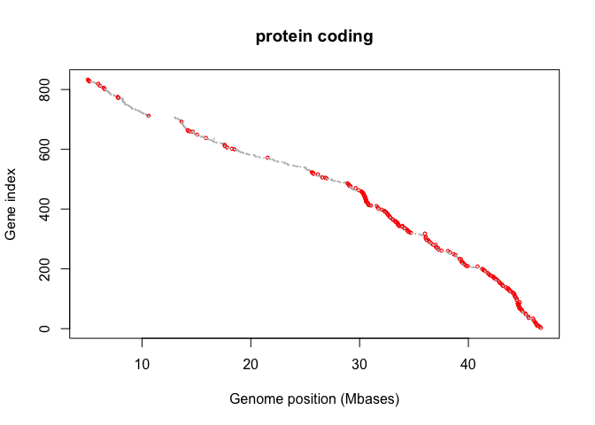
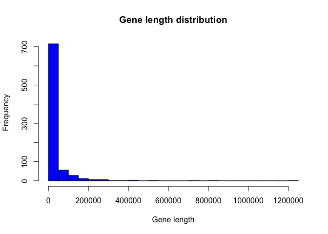
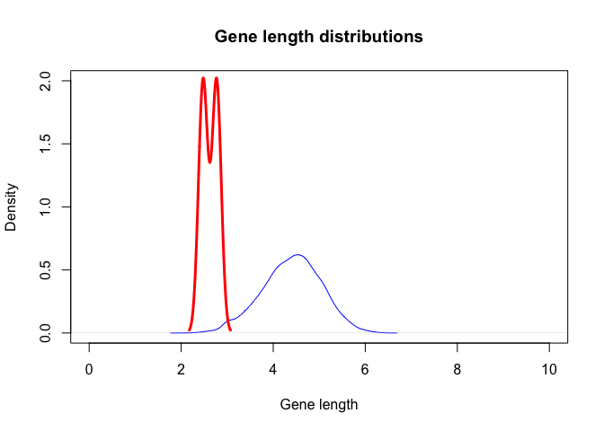

Material semana 11 Octubre 2021
================

*Exercise 1:* Explore the dimensions of the gencode data frame. How many
rows and columns has gencode?

``` r
# Read data
gencode <- read.table(file ="gencode_GRCh38.txt", header=TRUE, stringsAsFactors = FALSE)
# Show first rows of data
print(head(gencode))
```

    ##             gene_id   gene_name chromosome start   end strand
    ## 1 ENSG00000223972.5     DDX11L1       chr1 11869 14409      +
    ## 2 ENSG00000227232.5      WASH7P       chr1 14404 29570      -
    ## 3 ENSG00000278267.1   MIR6859-1       chr1 17369 17436      -
    ## 4 ENSG00000243485.5 MIR1302-2HG       chr1 29554 31109      +
    ## 5 ENSG00000284332.1   MIR1302-2       chr1 30366 30503      +
    ## 6 ENSG00000237613.2     FAM138A       chr1 34554 36081      -
    ##                                 type
    ## 1 transcribed_unprocessed_pseudogene
    ## 2             unprocessed_pseudogene
    ## 3                              miRNA
    ## 4                            lincRNA
    ## 5                              miRNA
    ## 6                            lincRNA

``` r
# Option 1
dim(gencode)
```

    ## [1] 58721     7

``` r
# Option 2
print(nrow(gencode))
```

    ## [1] 58721

``` r
print(ncol(gencode))
```

    ## [1] 7

*Exercise 2:* Get the values from the last 2 rows of the last 2 columns
in gencode data.frame.

``` r
# Option 1
gencode[58720:58721,6:7]
```

    ##       strand    type
    ## 58720      + Mt_tRNA
    ## 58721      - Mt_tRNA

``` r
# Option 2
tail(gencode,2)
```

    ##                 gene_id gene_name chromosome start   end strand    type
    ## 58720 ENSG00000210195.2     MT-TT       chrM 15888 15953      + Mt_tRNA
    ## 58721 ENSG00000210196.2     MT-TP       chrM 15956 16023      - Mt_tRNA

*Exercise 3:* Calculate the number of characters in your first and last
name (exactly as your name appears in the CV and including blank
spaces), multiply this number by the day and then by the month of your
birthday. Use the resulting number as a row number index to select the
correspoding gene in gencode data frame.

``` r
# Use the nchar function
n <- nchar('Firstname Lastname')
myindex = n*1*1
# data[row, columns]
gencode[myindex,]
```

    ##              gene_id  gene_name chromosome  start    end strand    type
    ## 18 ENSG00000241599.1 AL627309.4       chr1 160446 161525      + lincRNA

*Exercise 4:* Which chromosome has the smallest number of lincRNA genes?

``` r
# Subset
gencode.l <- subset(gencode, type=='lincRNA')
# Count
mycounts <- table(gencode.l$chromosome)
lowest = min(mycounts)
mycounts[mycounts==lowest]
```

    ## chrY 
    ##   56

*Exercise 5:* How many different gene names have at least a letter “X”
or “x” in gencode?

``` r
# Count
table(grepl('x', gencode$gene_name))
```

    ## 
    ## FALSE 
    ## 58721

*Exercise 6:* Plot genome positions and index, as we did in 10.1, but
using red colors for “protein_coding” genes and select the chromosome
that has been assigned to you. (Note: Save the plot as a PDF in 5 x 5
inches).

``` r
# Subset data
gencode.21 <- subset(gencode, chromosome=="chr21")
# Create a new column
gencode.21$position <- gencode.21$start + (gencode.21$end - gencode.21$start)
# Plot
plot(x = gencode.21$position/1E6,
     y = length(gencode.21$position):1,
     col=ifelse(gencode.21$type=="protein_coding","red","grey"),
     cex=ifelse(gencode.21$type=="protein_coding",0.5,0.1),
     main="protein coding",
     xlab="Genome position (Mbases)",
     ylab="Gene index")
abline(v=60)
```

<!-- -->

*Exercise 7:* Estimate based on the information of gene annotation in
genecode the length of the chromosome that has been assigned to you.

``` r
# Get the max ot the column end
max(gencode.21$end)
```

    ## [1] 46691226

*Exercise 8:* What are the longest gene within the chromosome assigned
to you?

``` r
# Get a rough idea with a histogram
hist(x = (gencode.21$end - gencode.21$start),
     xlab="Gene length",
     main = "Gene length distribution",
     col="blue",
     breaks = 20 )
```

<!-- -->

``` r
# Create a new column named lenghts
gencode.21$lenghts <- gencode.21$end - gencode.21$start
# Find the max in that column
longest <- max(gencode.21$lenghts)
gencode.21[which(gencode.21$lenght==longest),]
```

    ##                  gene_id gene_name chromosome    start      end strand
    ## 54076 ENSG00000159216.18     RUNX1      chr21 34787801 36004667      -
    ##                 type position lenghts
    ## 54076 protein_coding 36004667 1216866

*Exercise 9:* What is the shortest gene within the chromosome assigned
to you?

``` r
# Find the min in the column lenghts
shortest <- min(gencode.21$lenghts)
gencode.21[which(gencode.21$lenght==shortest),]
```

    ##                 gene_id gene_name chromosome    start      end strand   type
    ## 54296 ENSG00000266692.1   RF00285      chr21 44437121 44437175      + snoRNA
    ##       position lenghts
    ## 54296 44437175      54

*Exercise 10:* Make one density plot for the gene length distribution of
protein coding genes and add another density line for the gene length
distribution of all non-protein-coding genes. Use in this exercise all
chromosomes in order to optimise the visualisation of the differences.
(Note: Save the plot as a PDF in 5 x 5 inches).

``` r
# Subset data
gencode.PC <- subset(gencode, type=="protein_coding")
gencode.NPC <- subset(gencode, type=="non_coding")

# Use density function
gene.length.density.PC <- density(x = log10(gencode.PC$end - gencode.PC$start) , bw = 0.1)
gene.length.density.NPC <- density(x = log10(gencode.NPC$end - gencode.NPC$start) , bw = 0.1)

# Plot
plot(x = gene.length.density.PC,
     xlab="Gene length",
     main = "Gene length distributions",
     col="blue",
     xlim=c(0,10),
     ylim=c(0,2))

lines(gene.length.density.NPC,
      col="red",
      lwd=3)
```

<!-- -->
