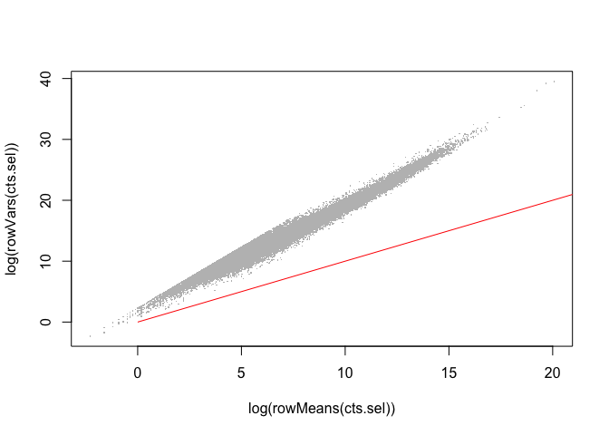
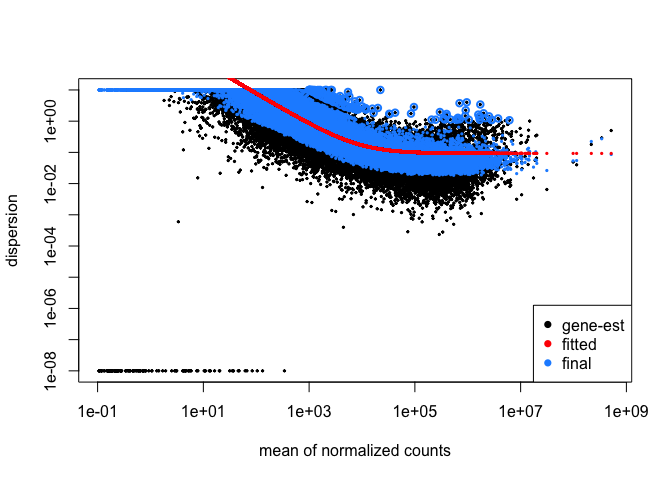
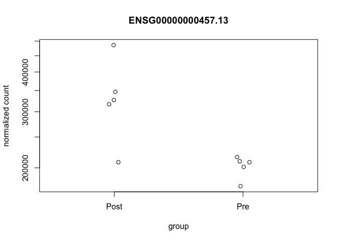
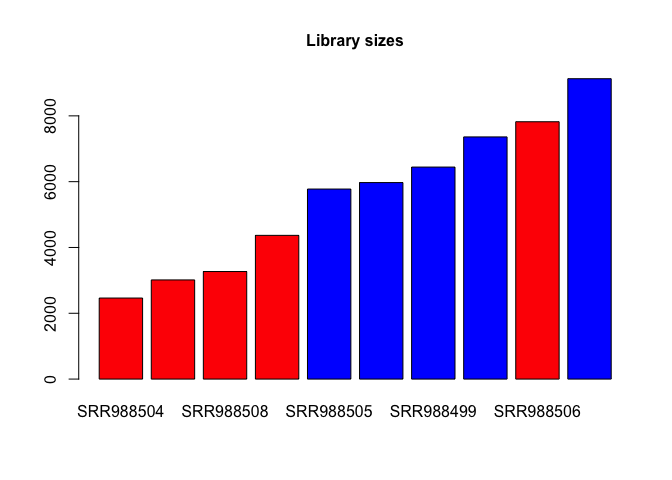
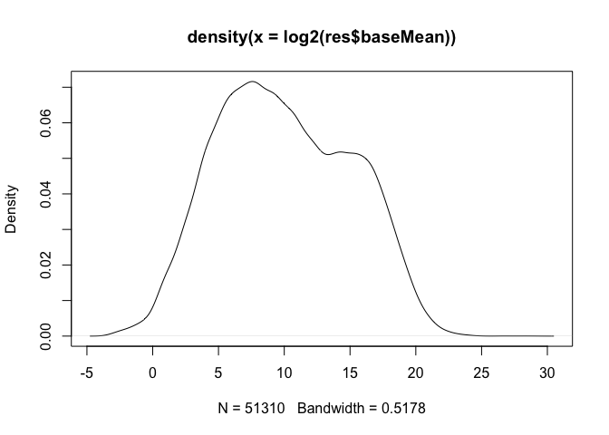
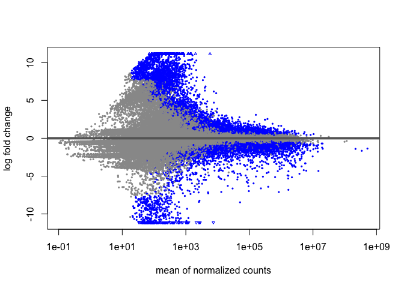
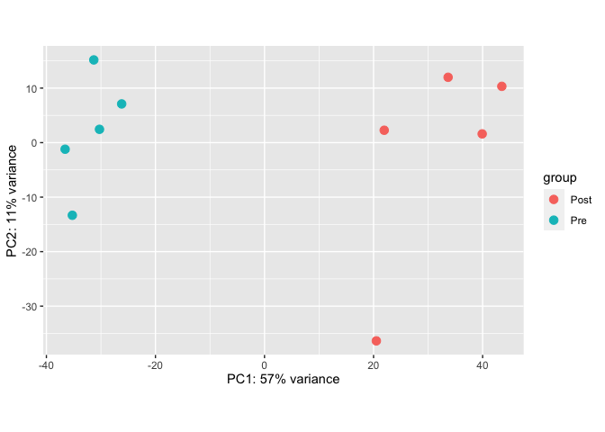
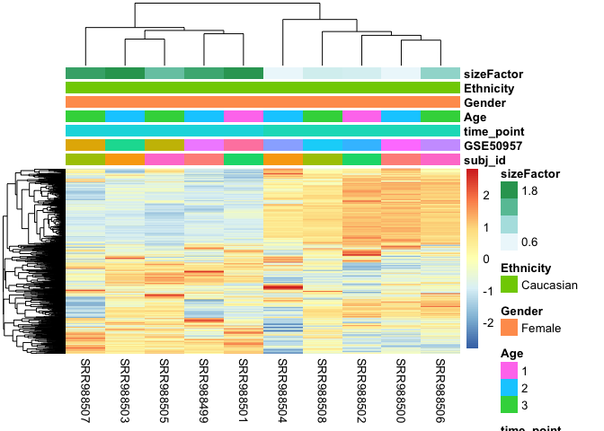
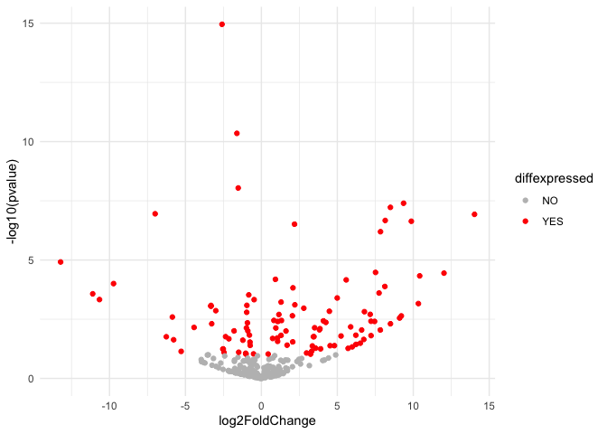

Material Semana Noviembre 19 2021
================

``` r
# Set working directory
#getwd()
setwd("/Users/kalilamali/Documents/cursos/ucm_genomes_and_genome_analysis/S4_Transcriptomics/")
```

*1. Load gene quantifications from alignment:*

``` r
# Install required packages
# install.packages("matrixStats")
# BiocManager::install("DESeq2")
# library(DESeq2)
# install.packages("pheatmap")
# 
# install.packages("igraph", type = "binary")
# if(!requireNamespace("remotes", quietly = TRUE))
#   install.packages("remotes")
# remotes::install_github("YuLab-SMU/clusterProfiler")
# 
# install.packages("tidyverse")
# BiocManager::install("org.Hs.eg.db")
```

Gene quantifications will result after completing an alignment,
quantifications can be calculated at the gene, transcript or exon level.

``` r
# Download raw counts per gene
# wget https://www.dropbox.com/s/91u3vk7fvrlk2jy/GSE50957_rnaseq_processed_data.RData

# Load data
load("GSE50957_rnaseq_processed_data.RData")

# Observe data
head(raw.gene.counts)
```

    ##                    SRR988499 SRR988500 SRR988501 SRR988502 SRR988503 SRR988504
    ## ENSG00000000003.14      1455       544     10404       783      6836      1181
    ## ENSG00000000005.5          0         0         0         0         0         0
    ## ENSG00000000419.12     97204     63260     89508     58201     83810     26213
    ## ENSG00000000457.13    351336    237635    383686    196308    326656     99369
    ## ENSG00000000460.16    253436    148126    267076    119644    241164     64004
    ## ENSG00000000938.12   2540551   1287934   2059659   1285398   2994614    891256
    ##                    SRR988505 SRR988506 SRR988507 SRR988508 SRR988509 SRR988510
    ## ENSG00000000003.14      7989      1029      6745      1931       145      2440
    ## ENSG00000000005.5        232         0         0         0         0         0
    ## ENSG00000000419.12     80227    114935    113980     38403     56322     92171
    ## ENSG00000000457.13    261703    367493    350993    213754    249993    359318
    ## ENSG00000000460.16    216661    260023    227343    137474    162111    259913
    ## ENSG00000000938.12   1875628   2520774   1772534   1203014   1365339   2363177

``` r
head(sample.table)
```

    ##           subj_id   GSE50957 time_point Age Gender Ethnicity
    ## SRR988499       1 GSM1233280        Pre   2 Female Caucasian
    ## SRR988500       1 GSM1233281       Post   2 Female Caucasian
    ## SRR988501       2 GSM1233282        Pre   1 Female Caucasian
    ## SRR988502       2 GSM1233283       Post   1 Female Caucasian
    ## SRR988503       3 GSM1233284        Pre   2 Female Caucasian
    ## SRR988504       3 GSM1233285       Post   2 Female Caucasian

``` r
# Review if content in data is identical
identical(colnames(raw.gene.counts),rownames(sample.table))
```

    ## [1] FALSE

``` r
# Select the gene counts for which we have metadata
raw.gene.counts <- raw.gene.counts[,rownames(sample.table)]

# Rename data
sratable.sel <- sample.table
cts.sel <- raw.gene.counts

# Change data format
cts.sel <- as.matrix(cts.sel)

# the count data generated by RNA-seq exhibits overdispersion (variance > mean) and the statistical distribution used to model the counts needs to account for this overdispersion.
# Load package
library(matrixStats)
# This plot refers to the gene counts
plot(x = log(rowMeans(cts.sel)), y = log(rowVars(cts.sel)),
     pch=".", col="grey")
lines(x=0:100, y=0:100, col="red")
```

<!-- --> *2.
Differential expression analysis using DESeq2* We will complete a
differential expression analysis using a paired analysis. In this
analysis we will control for variation associated with individual
variation using the factor “subj_id”. The main condition for our
contrast would be the infection status which is determined by
“time_point”.

``` r
# Load package
library(DESeq2)
```

    ## Loading required package: S4Vectors

    ## Loading required package: stats4

    ## Loading required package: BiocGenerics

    ## 
    ## Attaching package: 'BiocGenerics'

    ## The following objects are masked from 'package:stats':
    ## 
    ##     IQR, mad, sd, var, xtabs

    ## The following objects are masked from 'package:base':
    ## 
    ##     anyDuplicated, aperm, append, as.data.frame, basename, cbind,
    ##     colnames, dirname, do.call, duplicated, eval, evalq, Filter, Find,
    ##     get, grep, grepl, intersect, is.unsorted, lapply, Map, mapply,
    ##     match, mget, order, paste, pmax, pmax.int, pmin, pmin.int,
    ##     Position, rank, rbind, Reduce, rownames, sapply, setdiff, sort,
    ##     table, tapply, union, unique, unsplit, which.max, which.min

    ## 
    ## Attaching package: 'S4Vectors'

    ## The following object is masked from 'package:utils':
    ## 
    ##     findMatches

    ## The following objects are masked from 'package:base':
    ## 
    ##     expand.grid, I, unname

    ## Loading required package: IRanges

    ## Loading required package: GenomicRanges

    ## Loading required package: GenomeInfoDb

    ## Loading required package: SummarizedExperiment

    ## Loading required package: MatrixGenerics

    ## 
    ## Attaching package: 'MatrixGenerics'

    ## The following objects are masked from 'package:matrixStats':
    ## 
    ##     colAlls, colAnyNAs, colAnys, colAvgsPerRowSet, colCollapse,
    ##     colCounts, colCummaxs, colCummins, colCumprods, colCumsums,
    ##     colDiffs, colIQRDiffs, colIQRs, colLogSumExps, colMadDiffs,
    ##     colMads, colMaxs, colMeans2, colMedians, colMins, colOrderStats,
    ##     colProds, colQuantiles, colRanges, colRanks, colSdDiffs, colSds,
    ##     colSums2, colTabulates, colVarDiffs, colVars, colWeightedMads,
    ##     colWeightedMeans, colWeightedMedians, colWeightedSds,
    ##     colWeightedVars, rowAlls, rowAnyNAs, rowAnys, rowAvgsPerColSet,
    ##     rowCollapse, rowCounts, rowCummaxs, rowCummins, rowCumprods,
    ##     rowCumsums, rowDiffs, rowIQRDiffs, rowIQRs, rowLogSumExps,
    ##     rowMadDiffs, rowMads, rowMaxs, rowMeans2, rowMedians, rowMins,
    ##     rowOrderStats, rowProds, rowQuantiles, rowRanges, rowRanks,
    ##     rowSdDiffs, rowSds, rowSums2, rowTabulates, rowVarDiffs, rowVars,
    ##     rowWeightedMads, rowWeightedMeans, rowWeightedMedians,
    ##     rowWeightedSds, rowWeightedVars

    ## Loading required package: Biobase

    ## Welcome to Bioconductor
    ## 
    ##     Vignettes contain introductory material; view with
    ##     'browseVignettes()'. To cite Bioconductor, see
    ##     'citation("Biobase")', and for packages 'citation("pkgname")'.

    ## 
    ## Attaching package: 'Biobase'

    ## The following object is masked from 'package:MatrixGenerics':
    ## 
    ##     rowMedians

    ## The following objects are masked from 'package:matrixStats':
    ## 
    ##     anyMissing, rowMedians

``` r
# Controling for variation in the subjects "subj_id"
# We are contrasting infection status which is determined by “time_point”
dds <- DESeqDataSetFromMatrix(countData = cts.sel,
                              colData = sratable.sel,
                              design = ~ subj_id + time_point)
```

    ## converting counts to integer mode

``` r
# Remove empty rows
dds <- dds[ rowSums(counts(dds)) > 1, ]

dds <- DESeq(dds)
```

    ## estimating size factors

    ## estimating dispersions

    ## gene-wise dispersion estimates

    ## mean-dispersion relationship

    ## final dispersion estimates

    ## fitting model and testing

``` r
plotDispEsts(dds)
```

<!-- --> Now we
can check the result of the contrast defining our threshold of
significance using the adjusted P-value, also know as False Discovery
Rate (FDR). In this case we will use a 5% of FDR or 0.05 asjusted pvalue
as the limit to reject the null hypothesis.

``` r
# Check result names
resultsNames(dds)
```

    ## [1] "Intercept"              "subj_id_2_vs_1"         "subj_id_3_vs_1"        
    ## [4] "subj_id_4_vs_1"         "subj_id_5_vs_1"         "time_point_Pre_vs_Post"

``` r
# Threshold with pvalue
res <- results(dds, contrast = c("time_point", "Pre", "Post"), alpha = 0.05)

# LFC stands for logFoldChange to see which ones are expressed and which ones are not.
summary(res)
```

    ## 
    ## out of 51310 with nonzero total read count
    ## adjusted p-value < 0.05
    ## LFC > 0 (up)       : 5823, 11%
    ## LFC < 0 (down)     : 4066, 7.9%
    ## outliers [1]       : 0, 0%
    ## low counts [2]     : 6964, 14%
    ## (mean count < 19)
    ## [1] see 'cooksCutoff' argument of ?results
    ## [2] see 'independentFiltering' argument of ?results

``` r
# Save the results in a RData file
save(dds, res, cts.sel, sratable.sel, file = "results_DEG_GSE50957_all_genes_more_than_1.RData")
```

Plot Counts of any gene using PlotCounts function from DESeq2. Plot the
read counts per gene, normalized comparing across conditions:

``` r
plotCounts(dds, gene="ENSG00000000457.13", intgroup = "time_point")
```

<!-- --> *3.
Exploratory data analysis (EDA)* 3.1 Quality Control (QC) of libraries.
To estimate library sizes, we have to sum all aligned reads per sample.

``` r
colSums(counts(dds))
```

    ##  SRR988499  SRR988500  SRR988501  SRR988502  SRR988503  SRR988504  SRR988505 
    ## 6443625112 3013403584 7359833775 4368166895 9128726360 2462862643 5775649301 
    ##  SRR988506  SRR988507  SRR988508 
    ## 7821022990 5972220256 3268832601

Library sizes plots:

``` r
# Sum gene counts for each sample and order it
sorted.cts.sel <- sort(colSums(cts.sel))/1E6
# Order the other table acording the sample order above
sratable.sel.2 <- sratable.sel[names(sorted.cts.sel),]

# Plot library sizes per sample
barplot(sorted.cts.sel,
        horiz = F,
        cex.main= 1,
        main="Library sizes", # Title
        col=ifelse(sratable.sel.2$time_point=="Pre", "blue", "red"))
```

<!-- --> 3.2 Gene
expresion distribution and MA plots. For mean expression distribution
across all samples:

``` r
plot(density(log2(res$baseMean)))
```

<!-- --> For MA
plot:

``` r
plotMA(res)
```

<!-- --> 3.3
Principal Component Analysis (PCA). We can devise the main source of
variation in our data using PCA of the top variable genes in our
dataset. The selection of top variable genes MUST be independent of the
differential expression results.

``` r
## Variant Stabilization Dispersion and Principal Component Analysis

# Do the vts: variant stabilization dispersion
vsd <- vst(dds)
vst.counts <- assay(vsd)
# Do the PCA
DESeq2::plotPCA(vsd, intgroup = c("time_point"), ntop=1000)
```

    ## using ntop=1000 top features by variance

<!-- --> 3.4
Heatmap of top variable genes

``` r
## Heatmap of highly variable genes
library(matrixStats)

# Sort the vst
top.genes <- vst.counts[order(rowVars(vst.counts), decreasing = T)[1:1000],]

# Load the package
library(pheatmap)

# Plot
pheatmap(top.genes,
         annotation = as.data.frame(colData(dds)),# filename = "Heatmap.pdf",
         scale="row", show_rownames = FALSE)
```

<!-- --> *4.
Functional enrichment analysis using Gene Ontology.* Gene Ontoloty:
<http://geneontology.org>

``` r
## Enrichment analysis of over-represented GO terms
# Load packages
library(clusterProfiler)
```

    ## 

    ## clusterProfiler v4.11.0.001  For help: https://yulab-smu.top/biomedical-knowledge-mining-book/
    ## 
    ## If you use clusterProfiler in published research, please cite:
    ## T Wu, E Hu, S Xu, M Chen, P Guo, Z Dai, T Feng, L Zhou, W Tang, L Zhan, X Fu, S Liu, X Bo, and G Yu. clusterProfiler 4.0: A universal enrichment tool for interpreting omics data. The Innovation. 2021, 2(3):100141

    ## 
    ## Attaching package: 'clusterProfiler'

    ## The following object is masked from 'package:IRanges':
    ## 
    ##     slice

    ## The following object is masked from 'package:S4Vectors':
    ## 
    ##     rename

    ## The following object is masked from 'package:stats':
    ## 
    ##     filter

``` r
library(ggplot2)
library(org.Hs.eg.db)
```

    ## Loading required package: AnnotationDbi

    ## 
    ## Attaching package: 'AnnotationDbi'

    ## The following object is masked from 'package:clusterProfiler':
    ## 
    ##     select

    ## 

``` r
ego <- enrichGO(gene          = substr(rownames(subset(res, padj < 0.05)),1,15),
                universe      = substr(rownames(res),1,15),
                keyType       = 'ENSEMBL',
                OrgDb         = org.Hs.eg.db,
                ont           = "BP",
                pAdjustMethod = "BH",
                pvalueCutoff  = 0.05,
                qvalueCutoff  = 0.05,
                readable      = TRUE)


pdf(file = "dotplot_Pre_vs_Post_malaria.pdf", width = 30, height = 30)
dotplot(ego, showCategory=200) + ggtitle("dotplot for Pre_vs_Post")
dev.off()
```

    ## quartz_off_screen 
    ##                 2

# Tutorial:

<https://bioconductor.org/packages/release/bioc/vignettes/DESeq2/inst/doc/DESeq2.html>
\# Significado de plots:
<https://hbctraining.github.io/DGE_workshop/lessons/04_DGE_DESeq2_analysis.html>

# Homeworks:

*Exercise 1: Which is the gene with higher absolute fold change in your
chromosome? Hint: You should use BioMart to obtain the corresponding
chromosome of genes and, it would be preferable to use ENSEMBL Gene ID
stable.*

Results tables are generated using the function results, which extracts
a results table with log2 fold changes, p values and adjusted p values.

``` r
# Select a BioMart database and dataset
library("biomaRt")
my.ensembl.mart = useEnsembl("ENSEMBL_MART_ENSEMBL")
hs.dataset = useDataset("hsapiens_gene_ensembl", mart=my.ensembl.mart)

# Build a BioMart query
available.filters = listFilters(hs.dataset)
head(available.filters)
```

    ##              name              description
    ## 1 chromosome_name Chromosome/scaffold name
    ## 2           start                    Start
    ## 3             end                      End
    ## 4      band_start               Band Start
    ## 5        band_end                 Band End
    ## 6    marker_start             Marker Start

``` r
available.attributes = listAttributes(hs.dataset)
available.attributes <- subset(available.attributes, page!="homologs")
head(cbind(available.attributes[1:(360/2),], available.attributes[((360/2)+1):360,]))
```

    ##                            name                  description         page
    ## 1               ensembl_gene_id               Gene stable ID feature_page
    ## 2       ensembl_gene_id_version       Gene stable ID version feature_page
    ## 3         ensembl_transcript_id         Transcript stable ID feature_page
    ## 4 ensembl_transcript_id_version Transcript stable ID version feature_page
    ## 5            ensembl_peptide_id            Protein stable ID feature_page
    ## 6    ensembl_peptide_id_version    Protein stable ID version feature_page
    ##                   name              description         page
    ## 1 interpro_description     Interpro Description feature_page
    ## 2       interpro_start           Interpro start feature_page
    ## 3         interpro_end             Interpro end feature_page
    ## 4            alphafold       AFDB-ENSP mappings feature_page
    ## 5      alphafold_start AFDB-ENSP mappings start feature_page
    ## 6        alphafold_end   AFDB-ENSP mappings end feature_page

``` r
# Query
myvals = c('21')
mycols = c('ensembl_gene_id_version','chromosome_name')
anndf <- getBM(attributes=mycols,
      filters = 'chromosome_name', 
      values = myvals, 
      mart = hs.dataset)

# Get the results from the differential expression analysis (DEA)
#dds <- DESeq(dds)
#res <- results(dds)
res
```

    ## log2 fold change (MLE): time_point Pre vs Post 
    ## Wald test p-value: time point Pre vs Post 
    ## DataFrame with 51310 rows and 6 columns
    ##                       baseMean log2FoldChange     lfcSE      stat      pvalue
    ##                      <numeric>      <numeric> <numeric> <numeric>   <numeric>
    ## ENSG00000000003.14   2916.7939       1.092111  0.526636  2.073749 0.038102660
    ## ENSG00000000005.5      17.8462      -0.790889  3.099632 -0.255156 0.798602777
    ## ENSG00000000419.12  72829.8586      -0.592682  0.257063 -2.305593 0.021133384
    ## ENSG00000000457.13 269476.2072      -0.688809  0.195329 -3.526404 0.000421244
    ## ENSG00000000460.16 181818.6731      -0.521957  0.195709 -2.667009 0.007652972
    ## ...                        ...            ...       ...       ...         ...
    ## ENSG00000283695.1      4.49657       0.661342  3.058615  0.216223 8.28814e-01
    ## ENSG00000283696.1   2042.98483      -2.237283  1.377030 -1.624716 1.04223e-01
    ## ENSG00000283697.1   2076.05787       0.458047  0.598684  0.765090 4.44218e-01
    ## ENSG00000283698.1     34.18690      -1.318399  2.989108 -0.441068 6.59164e-01
    ## ENSG00000283699.1   1251.66500       1.931359  0.460031  4.198324 2.68897e-05
    ##                           padj
    ##                      <numeric>
    ## ENSG00000000003.14  0.12562713
    ## ENSG00000000005.5           NA
    ## ENSG00000000419.12  0.08093944
    ## ENSG00000000457.13  0.00404687
    ## ENSG00000000460.16  0.03753774
    ## ...                        ...
    ## ENSG00000283695.1           NA
    ## ENSG00000283696.1  0.258833769
    ## ENSG00000283697.1  0.681141192
    ## ENSG00000283698.1  0.844761467
    ## ENSG00000283699.1  0.000451174

``` r
# Get the absolute fold change
#The opposite of log2(x) is 2^(x)
resdf <- data.frame(res)
resdf$FoldChange <- abs(2^(resdf$log2FoldChange))
resdf$ensembl_gene_id_version <- rownames(resdf)
#resdf$ensembl_gene_id_version <- gsub("\\.","",resdf$ensembl_gene_id_version)

# Join both dfs
newdf <- merge(resdf, anndf, by='ensembl_gene_id_version')

# Sort column FoldChange from more to less
highfcdf<- newdf[order(-newdf$FoldChange),]
highfcdf
```

    ##     ensembl_gene_id_version     baseMean log2FoldChange     lfcSE        stat
    ## 120       ENSG00000227999.1 7.464976e+02   14.033322940 2.6494993  5.29659425
    ## 172       ENSG00000232010.1 1.342625e+02   12.023966522 2.9093672  4.13284595
    ## 257       ENSG00000252045.1 7.986045e+01   10.424626623 2.5605190  4.07129443
    ## 210       ENSG00000235277.1 9.442915e+01   10.336893999 3.0468618  3.39263633
    ## 9         ENSG00000184385.2 3.795920e+02    9.872735925 1.9088225  5.17216036
    ## 347       ENSG00000279381.1 6.603175e+02    9.362575040 1.7052509  5.49043844
    ## 367       ENSG00000279851.2 3.693591e+01    9.213900178 3.0221034  3.04883680
    ## 4         ENSG00000175302.5 4.247520e+01    9.101206286 3.0472355  2.98670921
    ## 67        ENSG00000223488.2 2.162718e+01    8.498337822 3.0227491  2.81145989
    ## 317       ENSG00000276633.1 7.821845e+02    8.495793024 1.5676615  5.41940543
    ## 135       ENSG00000228961.1 4.079631e+02    8.153959833 1.5721224  5.18659337
    ## 181       ENSG00000232687.1 3.778751e+02    8.129567581 2.1260150  3.82385247
    ## 26        ENSG00000201984.1 1.931657e+02    7.843124575 1.5750973  4.97945396
    ## 284       ENSG00000272958.1 9.043266e+01    7.830672461 2.9989389  2.61114775
    ## 276       ENSG00000267857.2 2.240028e+02    7.749410144 2.1145366  3.66482676
    ## 207       ENSG00000235012.1 3.281524e+02    7.517019813 1.8118017  4.14891974
    ## 79        ENSG00000224413.1 5.576089e+01    7.454051148 2.5840005  2.88469411
    ## 339       ENSG00000279177.1 1.923916e+02    7.221237873 2.9853018  2.41893056
    ## 319       ENSG00000276873.1 1.673768e+02    7.218818085 2.4982498  2.88955010
    ## 322       ENSG00000277282.1 8.204217e+01    7.164700828 2.3157686  3.09387602
    ## 289       ENSG00000273104.1 1.594525e+02    6.784485892 2.1400422  3.17025803
    ## 344       ENSG00000279303.1 9.157824e+01    6.744006004 2.9578967  2.28000049
    ## 338       ENSG00000279094.3 1.290942e+02    6.601952685 2.5290406  2.61045736
    ## 310       ENSG00000275708.1 2.629777e+01    6.515578882 3.0483722  2.13739611
    ## 376       ENSG00000280330.1 1.620087e+02    6.228166061 2.9807013  2.08949687
    ## 354       ENSG00000279579.3 1.069325e+02    6.219621853 2.5568366  2.43254565
    ## 371       ENSG00000280019.1 3.442874e+01    5.982687271 3.0077472  1.98909248
    ## 274       ENSG00000266195.2 9.190760e+01    5.878866956 2.1666189  2.71338299
    ## 259       ENSG00000252619.1 3.234110e+01    5.710341966 2.9603186  1.92896196
    ## 216       ENSG00000235890.2 2.310987e+03    5.584726464 1.4034875  3.97917792
    ## 195       ENSG00000234008.5 1.074123e+02    5.244703325 2.1814446  2.40423399
    ## 158       ENSG00000231058.1 1.057539e+01    5.073794063 3.0245541  1.67753455
    ## 179       ENSG00000232608.1 6.641954e+02    4.993207936 1.4108011  3.53927134
    ## 375       ENSG00000280243.1 6.373891e+01    4.893302154 2.9920560  1.63543136
    ## 194       ENSG00000233997.5 5.162468e+01    4.810614191 2.3578548  2.04025040
    ## 108       ENSG00000226996.5 4.878488e+01    4.525763950 2.2204260  2.03824129
    ## 115       ENSG00000227698.1 4.940202e+02    4.477275765 1.4069059  3.18235633
    ## 142       ENSG00000229306.1 4.599229e+01    4.420885295 2.9755171  1.48575363
    ## 174       ENSG00000232193.1 1.045531e+01    4.362482900 3.0029973  1.45270955
    ## 178       ENSG00000232539.1 6.623962e+02    4.246338467 1.4877688  2.85416547
    ## 25        ENSG00000201812.1 3.314643e+01    4.152061596 3.0099678  1.37943720
    ## 379       ENSG00000280604.1 1.511936e+03    4.084199387 1.4080023  2.90070497
    ## 63        ENSG00000221859.2 3.741925e+01    4.038037313 2.9766230  1.35658340
    ## 78        ENSG00000224388.1 5.040071e+02    3.898966739 2.0438431  1.90766442
    ## 45        ENSG00000214955.5 1.158864e+03    3.858390580 1.4538369  2.65393628
    ## 238       ENSG00000238141.2 8.278025e+02    3.827304344 1.4625065  2.61694857
    ## 49        ENSG00000215317.2 1.234823e+01    3.795537527 2.9871459  1.27062340
    ## 48        ENSG00000215088.3 1.169136e+02    3.575406774 1.8472451  1.93553455
    ## 261       ENSG00000252950.1 5.188118e+02    3.507195230 1.3064716  2.68447865
    ## 234       ENSG00000237646.1 3.116991e+02    3.461794075 1.4530968  2.38235618
    ## 304       ENSG00000275139.1 8.408764e+02    3.423482492 1.4391529  2.37881777
    ## 95        ENSG00000225731.1 3.142586e+02    3.356450008 1.6550208  2.02804096
    ## 224       ENSG00000236883.1 9.015751e+02    3.314912795 1.8337126  1.80776024
    ## 29        ENSG00000205445.3 3.109601e+02    3.240497664 1.9381920  1.67191781
    ## 248       ENSG00000243489.4 1.962739e+01    3.158899971 2.9702218  1.06352327
    ## 377       ENSG00000280372.1 2.564390e+02    2.977479677 1.7251835  1.72589153
    ## 278       ENSG00000270116.1 5.216908e+03    2.793089478 0.8547467  3.26773950
    ## 113       ENSG00000227406.1 9.779920e+00    2.753030115 2.9063793  0.94723702
    ## 147       ENSG00000229880.1 8.818822e+01    2.653208002 1.8162982  1.46077779
    ## 2         ENSG00000168122.4 9.280173e+01    2.577971395 2.2195425  1.16148776
    ## 15        ENSG00000197934.8 7.533126e+02    2.471825887 1.7421006  1.41887667
    ## 156       ENSG00000230965.1 4.835281e+02    2.342036845 1.7948403  1.30487199
    ## 122       ENSG00000228137.1 1.132973e+03    2.203871633 0.6559580  3.35977543
    ## 359       ENSG00000279690.1 3.971609e+03    2.181123367 0.4261044  5.11875364
    ## 138       ENSG00000229046.1 5.037154e+03    2.079704784 0.5484949  3.79165758
    ## 335       ENSG00000278931.1 9.012141e+02    2.062773204 0.9424835  2.18865701
    ## 185       ENSG00000232969.1 4.822792e+01    2.045272484 2.0630221  0.99139630
    ## 228       ENSG00000237373.1 1.116249e+03    2.044339100 0.6695839  3.05314858
    ## 53        ENSG00000215369.3 2.551357e+02    1.736680738 1.2666449  1.37108735
    ## 351       ENSG00000279493.1 1.213677e+02    1.716817407 2.3921249  0.71769556
    ## 358       ENSG00000279687.1 1.166126e+02    1.715882943 2.0100607  0.85364734
    ## 334       ENSG00000278878.1 2.589529e+02    1.693037148 0.8224090  2.05863159
    ## 40        ENSG00000213440.2 1.421607e+03    1.620710860 0.6290012  2.57664205
    ## 385       ENSG00000283300.1 2.998734e+02    1.606752702 1.7629761  0.91138652
    ## 88        ENSG00000225043.1 8.365802e+02    1.587363088 1.1474450  1.38338922
    ## 11        ENSG00000185390.2 6.656499e+01    1.468140119 2.5364764  0.57881086
    ## 89        ENSG00000225218.1 2.679092e+02    1.447252377 1.1235791  1.28807341
    ## 124       ENSG00000228184.1 2.632824e+01    1.444385931 2.9437197  0.49066693
    ## 372       ENSG00000280145.3 1.644546e+03    1.319988677 0.4532489  2.91228240
    ## 201       ENSG00000234293.1 2.131788e+03    1.296384260 0.3777212  3.43211911
    ## 71        ENSG00000223692.1 2.829225e+03    1.295422441 0.5335906  2.42774599
    ## 5         ENSG00000176054.6 7.735512e+02    1.276234023 0.9328402  1.36811647
    ## 104       ENSG00000226818.1 1.079344e+02    1.222583995 1.4708154  0.83122872
    ## 192       ENSG00000233818.1 1.720289e+02    1.220697757 2.1011847  0.58095691
    ## 226       ENSG00000237325.3 5.128020e+01    1.175190456 3.0425058  0.38625743
    ## 265       ENSG00000261610.1 2.694529e+02    1.171187455 2.1995378  0.53246979
    ## 370       ENSG00000280013.1 1.415962e+01    1.166216138 3.0529906  0.38199139
    ## 295       ENSG00000273840.1 2.016738e+03    1.153705394 0.3733991  3.08973787
    ## 264       ENSG00000260583.1 3.247462e+03    1.143887018 1.1335858  1.00908730
    ## 384       ENSG00000283051.1 2.045115e+01    1.110806640 3.0629571  0.36265824
    ## 152       ENSG00000230366.9 5.499251e+03    1.079950512 0.3745548  2.88329135
    ## 281       ENSG00000272657.1 3.252402e+03    1.068822243 0.4838546  2.20897413
    ## 57        ENSG00000215562.2 1.648168e+02    1.067442221 1.2620891  0.84577406
    ## 130       ENSG00000228677.1 2.725497e+03    1.052395104 0.4506521  2.33527192
    ## 198       ENSG00000234083.1 3.264666e+01    1.003713789 2.9398167  0.34142053
    ## 114       ENSG00000227438.1 1.818233e+01    0.973373774 3.0437106  0.31979840
    ## 241       ENSG00000239415.1 6.969856e+03    0.950804979 0.3550750  2.67775820
    ## 157       ENSG00000230982.1 1.640661e+04    0.925142839 0.2317586  3.99183791
    ## 373       ENSG00000280164.1 3.054294e+02    0.919187334 1.7777851  0.51704075
    ## 32        ENSG00000207147.1 2.537329e+00    0.910127932 3.0762567  0.29585565
    ## 254       ENSG00000249493.1 5.946322e+01    0.906468565 2.9903691  0.30312933
    ## 75        ENSG00000223901.2 1.426969e+03    0.884699987 1.1808390  0.74921304
    ## 324       ENSG00000277437.1 4.330813e+00    0.873916407 3.0601419  0.28558035
    ## 6         ENSG00000182912.6 2.555078e+03    0.873326417 0.5450416  1.60231162
    ## 173       ENSG00000232118.2 6.508805e+03    0.824560258 0.2829341  2.91431897
    ## 128       ENSG00000228404.1 1.123133e+03    0.807694909 1.0194709  0.79226874
    ## 204       ENSG00000234509.1 7.538573e+02    0.778779256 0.8188069  0.95111472
    ## 106       ENSG00000226935.6 5.039220e+03    0.757648480 0.5091781  1.48798331
    ## 280       ENSG00000270652.1 3.595401e+01    0.745688466 3.0432455  0.24503066
    ## 332       ENSG00000278618.1 1.675818e+01    0.742596900 3.0439547  0.24395793
    ## 287       ENSG00000273027.1 3.741851e+03    0.740296478 0.3196612  2.31587822
    ## 235       ENSG00000237731.1 1.121960e+01    0.734933572 3.0455526  0.24131370
    ## 361       ENSG00000279718.1 1.090728e+02    0.689984278 2.9874398  0.23096174
    ## 145       ENSG00000229623.1 1.253429e+03    0.673209161 1.1714131  0.57469832
    ## 151       ENSG00000230233.1 1.877057e+01    0.651924278 3.0460440  0.21402326
    ## 146       ENSG00000229761.1 1.026607e+02    0.651642839 2.8895422  0.22551768
    ## 323       ENSG00000277379.1 5.785629e+00    0.638087287 3.0488822  0.20928565
    ## 153       ENSG00000230379.5 3.462187e+00    0.615951333 3.0532490  0.20173636
    ## 340       ENSG00000279186.1 2.323662e+01    0.612946839 3.0430493  0.20142521
    ## 353       ENSG00000279534.1 6.751633e+01    0.611397031 3.0431629  0.20090841
    ## 357       ENSG00000279669.1 4.019236e+01    0.609138366 3.0435874  0.20013829
    ## 68        ENSG00000223563.1 6.005372e+01    0.602336220 3.0455836  0.19777366
    ## 165       ENSG00000231324.1 1.649801e+01    0.581245093 3.0487585  0.19064976
    ## 127       ENSG00000228355.1 9.965615e+00    0.575476222 3.0841762  0.18658993
    ## 214       ENSG00000235772.1 2.251744e+03    0.575422389 0.5655591  1.01743990
    ## 10        ENSG00000184441.4 1.076862e+04    0.574911464 0.3968954  1.44852135
    ## 369       ENSG00000279967.1 1.186867e+01    0.537298390 3.0449415  0.17645606
    ## 85        ENSG00000224747.1 1.386774e+01    0.532384427 2.9985001  0.17755024
    ## 352       ENSG00000279501.1 5.163087e+00    0.524247050 3.0478822  0.17200371
    ## 247       ENSG00000242553.1 5.856731e+03    0.498406251 0.3525407  1.41375514
    ## 200       ENSG00000234159.1 2.855214e+03    0.486857288 0.5398481  0.90184120
    ## 148       ENSG00000230061.2 2.948494e+02    0.485576184 2.2764613  0.21330307
    ## 252       ENSG00000248476.1 1.977866e+04    0.446934949 0.2663911  1.67774004
    ## 180       ENSG00000232623.1 1.653458e+02    0.444782472 1.4846440  0.29958863
    ## 14        ENSG00000189089.5 9.144564e+03    0.437541217 0.4160430  1.05167311
    ## 43        ENSG00000214889.3 5.158529e+02    0.423828024 0.9560858  0.44329499
    ## 155       ENSG00000230870.2 6.501814e+02    0.421180278 1.1857923  0.35518891
    ## 91        ENSG00000225298.5 4.681378e+00    0.414376424 3.0698491  0.13498267
    ## 136       ENSG00000229007.1 5.236007e+03    0.402328255 0.4947639  0.81317216
    ## 28        ENSG00000203616.2 8.143037e+02    0.391269892 0.6380493  0.61322830
    ## 213       ENSG00000235701.1 9.523756e+02    0.313613541 0.5968748  0.52542600
    ## 246       ENSG00000241728.5 1.090408e+04    0.304019675 0.3128823  0.97167416
    ## 94        ENSG00000225637.1 2.893241e+01    0.260144728 2.9897678  0.08701168
    ## 277       ENSG00000269950.1 4.803367e+02    0.257505396 1.5462785  0.16653235
    ## 294       ENSG00000273464.1 9.637368e+02    0.228898435 1.2421516  0.18427577
    ## 131       ENSG00000228817.4 8.551978e+03    0.207712810 0.3475803  0.59759654
    ## 123       ENSG00000228149.1 2.498541e+03    0.197846282 0.3024083  0.65423556
    ## 160       ENSG00000231125.2 6.887161e+03    0.170819246 0.1838201  0.92927383
    ## 285       ENSG00000272991.1 9.159908e+03    0.142042310 0.3745903  0.37919380
    ## 199       ENSG00000234107.1 1.454964e+02    0.124923195 1.2695363  0.09840065
    ## 356       ENSG00000279648.1 1.496038e+02    0.056938237 1.4825609  0.03840533
    ## 282       ENSG00000272825.1 3.395032e+03    0.023551884 0.6791582  0.03467805
    ## 211       ENSG00000235514.1 2.459990e+03    0.004618727 0.4994012  0.00924853
    ## 328       ENSG00000277991.4 4.780036e+03   -0.036904577 0.4236590 -0.08710916
    ## 59        ENSG00000217026.3 2.802625e+03   -0.049257895 0.3456568 -0.14250522
    ## 72        ENSG00000223741.1 4.862449e+01   -0.069385998 2.9883377 -0.02321893
    ## 202       ENSG00000234340.1 1.710606e+01   -0.086728686 3.0437899 -0.02849365
    ## 143       ENSG00000229336.1 9.681044e+02   -0.091509421 0.5790644 -0.15802979
    ## 300       ENSG00000274333.4 2.880457e+03   -0.104291179 0.4357197 -0.23935386
    ## 222       ENSG00000236545.1 1.375886e+02   -0.152199078 2.4586103 -0.06190451
    ## 308       ENSG00000275592.1 1.574598e+01   -0.166972276 3.0898499 -0.05403896
    ## 44        ENSG00000214914.3 1.305167e+03   -0.170084324 0.5378177 -0.31624901
    ## 293       ENSG00000273271.1 3.135568e+03   -0.174478459 0.5622326 -0.31033145
    ## 341       ENSG00000279208.1 9.399675e+02   -0.183562593 1.3733212 -0.13366326
    ## 209       ENSG00000235123.5 7.304269e+01   -0.188273522 2.6414871 -0.07127558
    ## 307       ENSG00000275496.4 2.581462e+03   -0.200005345 0.5894523 -0.33930712
    ## 164       ENSG00000231300.1 7.389686e+01   -0.214263751 2.5381966 -0.08441574
    ## 250       ENSG00000244294.3 2.727348e+02   -0.215761288 1.8228417 -0.11836535
    ## 166       ENSG00000231355.1 1.030340e+02   -0.221169048 2.8877273 -0.07658931
    ## 99        ENSG00000226054.2 2.924495e+04   -0.253114927 0.1590024 -1.59189337
    ## 312       ENSG00000275945.1 2.121199e+02   -0.258276399 0.8535132 -0.30260389
    ## 133       ENSG00000228930.1 7.944948e+02   -0.260518368 0.7957135 -0.32740221
    ## 286       ENSG00000273017.1 1.034775e+04   -0.263729465 0.2707058 -0.97422901
    ## 175       ENSG00000232260.2 6.215999e+02   -0.283794376 0.5462548 -0.51952751
    ## 362       ENSG00000279720.1 2.843927e+02   -0.304431465 1.6690074 -0.18240270
    ## 16        ENSG00000198618.5 3.706634e+05   -0.310945862 0.2926005 -1.06269782
    ## 42        ENSG00000214867.3 1.904472e+02   -0.321350127 2.9873129 -0.10757163
    ## 132       ENSG00000228861.5 2.748937e+02   -0.325756153 0.7958320 -0.40932777
    ## 311       ENSG00000275799.1 2.028207e+03   -0.340865995 0.6110685 -0.55781961
    ## 190       ENSG00000233754.2 3.356375e+01   -0.373069600 3.0995983 -0.12036063
    ## 54        ENSG00000215455.4 1.083048e+01   -0.374819484 3.1000778 -0.12090647
    ## 82        ENSG00000224598.1 7.348294e+02   -0.376323657 0.8064969 -0.46661515
    ## 343       ENSG00000279213.1 5.522471e+00   -0.377271705 3.1007540 -0.12167096
    ## 69        ENSG00000223662.1 5.415238e+00   -0.377370114 3.1007812 -0.12170163
    ## 320       ENSG00000276902.1 4.825460e+00   -0.377988536 3.1009523 -0.12189434
    ## 363       ENSG00000279751.1 1.018708e+00   -0.398223968 3.1066360 -0.12818495
    ## 292       ENSG00000273254.1 2.169693e+03   -0.423688153 0.3063755 -1.38290500
    ## 116       ENSG00000227702.1 3.496842e+01   -0.431624373 3.0995868 -0.13925223
    ## 118       ENSG00000227721.1 6.094848e+00   -0.435235412 3.1006119 -0.14037081
    ## 225       ENSG00000237202.1 4.371053e+00   -0.436914348 3.1010977 -0.14089022
    ## 52        ENSG00000215353.2 3.878540e+00   -0.437662474 3.1013151 -0.14112158
    ## 22        ENSG00000200754.1 3.324463e+00   -0.438763862 3.1016356 -0.14146209
    ## 297       ENSG00000274060.1 2.401001e+00   -0.441697965 3.1024935 -0.14236870
    ## 313       ENSG00000275950.1 2.401001e+00   -0.441697965 3.1024935 -0.14236870
    ## 364       ENSG00000279773.1 2.154744e+00   -0.442893922 3.1028443 -0.14273804
    ## 96        ENSG00000225735.1 1.908488e+00   -0.444387555 3.1032838 -0.14319913
    ## 305       ENSG00000275170.1 1.021093e+01   -0.466991931 3.0453643 -0.15334518
    ## 18        ENSG00000199598.1 1.666977e+01   -0.474780300 3.0997348 -0.15316804
    ## 253       ENSG00000249209.2 8.215962e+04   -0.477841692 0.1366853 -3.49592564
    ## 80        ENSG00000224427.1 7.755017e+02   -0.482374621 0.6959618 -0.69310507
    ## 318       ENSG00000276647.1 1.967579e+00   -0.483605019 3.1024282 -0.15587952
    ## 314       ENSG00000276077.4 1.516556e+03   -0.498766397 0.4157475 -1.19968585
    ## 55        ENSG00000215458.8 7.373145e+04   -0.514423215 0.3055734 -1.68346830
    ## 171       ENSG00000231986.1 3.560949e+00   -0.527935276 3.1010210 -0.17024563
    ## 117       ENSG00000227716.1 2.730061e+00   -0.529472854 3.1015190 -0.17071405
    ## 141       ENSG00000229289.1 2.670712e+00   -0.529618757 3.1015663 -0.17075848
    ## 1         ENSG00000160202.7 1.365030e+00   -0.535951320 3.1036287 -0.17268539
    ## 159       ENSG00000231123.1 2.421584e+04   -0.547407615 0.3912960 -1.39896049
    ## 65        ENSG00000223287.1 8.501176e+01   -0.568095818 2.2705175 -0.25020544
    ## 236       ENSG00000237841.1 3.560949e-01   -0.569651519 3.1149050 -0.18287926
    ## 217       ENSG00000236056.1 3.270357e+03   -0.594973723 0.7542737 -0.78880351
    ## 121       ENSG00000228107.1 4.079597e+03   -0.630640329 0.5722719 -1.10199414
    ## 37        ENSG00000212932.3 8.123341e+02   -0.656255974 0.6979257 -0.94029491
    ## 27        ENSG00000202239.1 7.245562e+01   -0.706850092 2.8882546 -0.24473261
    ## 290       ENSG00000273199.1 1.507371e+03   -0.737931095 0.3598419 -2.05070900
    ## 271       ENSG00000264452.1 1.679762e+02   -0.746321219 1.1557240 -0.64576078
    ## 348       ENSG00000279390.1 4.140351e+04   -0.749344200 0.3436718 -2.18040622
    ## 162       ENSG00000231201.1 3.132081e+03   -0.749567218 0.6212137 -1.20661736
    ## 275       ENSG00000266692.1 1.591156e+02   -0.752635214 1.5275192 -0.49271734
    ## 242       ENSG00000239930.2 2.283807e+02   -0.765611107 1.8400162 -0.41608933
    ## 102       ENSG00000226406.1 1.826645e+02   -0.768264105 1.7967518 -0.42758500
    ## 101       ENSG00000226298.1 1.040251e+03   -0.773780810 0.8531408 -0.90697906
    ## 212       ENSG00000235609.7 1.480259e+04   -0.787402191 0.3231248 -2.43683599
    ## 66        ENSG00000223431.1 7.223105e+01   -0.790478398 3.0994340 -0.25503960
    ## 197       ENSG00000234034.1 6.115408e+01   -0.790503532 3.0994458 -0.25504674
    ## 360       ENSG00000279709.1 3.092320e+01   -0.790660146 3.0995209 -0.25509108
    ## 167       ENSG00000231620.1 3.023088e+01   -0.790668003 3.0995244 -0.25509333
    ## 366       ENSG00000279788.1 2.353855e+01   -0.790758896 3.0995686 -0.25511902
    ## 7         ENSG00000184029.9 2.330778e+01   -0.790762914 3.0995705 -0.25512015
    ## 329       ENSG00000278181.1 1.792315e+01   -0.790886809 3.0996311 -0.25515514
    ## 154       ENSG00000230859.1 1.653852e+01   -0.790931323 3.0996530 -0.25516770
    ## 220       ENSG00000236400.1 1.315390e+01   -0.791080174 3.0997260 -0.25520971
    ## 237       ENSG00000237864.1 1.223082e+01   -0.791134689 3.0997530 -0.25522508
    ## 188       ENSG00000233442.2 1.192312e+01   -0.791154734 3.0997629 -0.25523073
    ## 365       ENSG00000279783.1 1.176928e+01   -0.791165150 3.0997680 -0.25523366
    ## 13        ENSG00000187766.1 1.161543e+01   -0.791175840 3.0997733 -0.25523668
    ## 333       ENSG00000278775.1 1.130774e+01   -0.791198092 3.0997843 -0.25524295
    ## 350       ENSG00000279477.1 1.115389e+01   -0.791209677 3.0997900 -0.25524622
    ## 39        ENSG00000212938.3 9.461575e+00   -0.791362480 3.0998652 -0.25528932
    ## 309       ENSG00000275664.1 8.923111e+00   -0.791422897 3.0998952 -0.25530634
    ## 87        ENSG00000224922.1 8.076954e+00   -0.791534074 3.0999502 -0.25533767
    ## 342       ENSG00000279211.1 7.769260e+00   -0.791580487 3.0999732 -0.25535075
    ## 105       ENSG00000226930.1 6.461563e+00   -0.791827371 3.1000953 -0.25542033
    ## 273       ENSG00000264580.1 5.230789e+00   -0.792170982 3.1002658 -0.25551712
    ## 81        ENSG00000224541.1 4.362273e+02   -0.792241995 2.2201474 -0.35684207
    ## 267       ENSG00000263681.1 5.000019e+00   -0.792254157 3.1003071 -0.25554054
    ## 70        ENSG00000223671.2 4.769249e+00   -0.792345343 3.1003524 -0.25556622
    ## 107       ENSG00000226956.1 4.000015e+00   -0.792725207 3.1005410 -0.25567319
    ## 355       ENSG00000279647.1 4.000015e+00   -0.792725207 3.1005410 -0.25567319
    ## 266       ENSG00000261706.1 3.307705e+00   -0.793216686 3.1007855 -0.25581153
    ## 299       ENSG00000274248.1 3.076935e+00   -0.793430981 3.1008913 -0.25587191
    ## 368       ENSG00000279895.1 2.307701e+00   -0.794444142 3.1013963 -0.25615692
    ## 100       ENSG00000226204.1 1.769238e+00   -0.795672454 3.1020094 -0.25650227
    ## 325       ENSG00000277671.1 1.769238e+00   -0.795672454 3.1020094 -0.25650227
    ## 170       ENSG00000231867.1 1.307697e+00   -0.797520685 3.1029334 -0.25702153
    ## 189       ENSG00000233676.2 9.230805e-01   -0.800450670 3.1044007 -0.25784386
    ## 233       ENSG00000237609.1 6.153870e-01   -0.805367432 3.1068717 -0.25922134
    ## 111       ENSG00000227330.1 1.097996e+02   -0.811393441 1.7536340 -0.46269258
    ## 74        ENSG00000223870.1 3.846169e-01   -0.814025496 3.1112469 -0.26163964
    ## 134       ENSG00000228941.1 5.084534e+02   -0.814967842 0.6173123 -1.32018731
    ## 56        ENSG00000215533.8 1.385045e+04   -0.830759977 0.2296375 -3.61770242
    ## 64        ENSG00000223262.1 6.009943e+02   -0.833990037 1.7449849 -0.47793540
    ## 30        ENSG00000206105.2 1.538467e-01   -0.846450113 3.1278865 -0.27061407
    ## 92        ENSG00000225330.1 1.538467e-01   -0.846450113 3.1278865 -0.27061407
    ## 12        ENSG00000187175.5 2.247462e+01   -0.848755799 3.0995801 -0.27382928
    ## 268       ENSG00000263969.2 1.085929e+03   -0.870666573 0.6638664 -1.31150877
    ## 321       ENSG00000277067.4 1.741127e+03   -0.892266987 0.3457062 -2.58099768
    ## 272       ENSG00000264462.1 3.494487e+01   -0.898130784 2.9891912 -0.30045947
    ## 346       ENSG00000279365.1 1.060678e+03   -0.901588992 0.6118034 -1.47365812
    ## 46        ENSG00000214976.2 9.050381e+01   -0.905801559 2.5223135 -0.35911538
    ## 98        ENSG00000226012.1 2.910852e+04   -0.917996869 0.3232078 -2.84026820
    ## 251       ENSG00000244676.5 1.759807e+04   -0.955869821 0.2857422 -3.34521757
    ## 232       ENSG00000237604.1 1.371648e+03   -0.966006039 1.2550887 -0.76967156
    ## 244       ENSG00000240770.5 1.012571e+04   -0.966986279 0.3066724 -3.15315693
    ## 327       ENSG00000277777.1 1.033804e+01   -0.974110697 3.0438955 -0.32002107
    ## 336       ENSG00000278996.1 1.951312e+04   -0.983912041 0.3673509 -2.67839838
    ## 73        ENSG00000223822.2 9.902694e+02   -1.015396806 0.6082066 -1.66949324
    ## 302       ENSG00000274662.1 1.159972e+03   -1.022168036 0.6030348 -1.69503982
    ## 177       ENSG00000232512.6 1.190352e+03   -1.032084393 0.6020443 -1.71429966
    ## 223       ENSG00000236677.1 5.274157e+02   -1.035657255 0.7720337 -1.34146633
    ## 260       ENSG00000252915.1 1.355518e+02   -1.045021310 1.7322582 -0.60327111
    ## 8         ENSG00000184274.3 3.207720e+02   -1.056269239 1.8590930 -0.56816374
    ## 110       ENSG00000227256.1 3.911995e+02   -1.086360591 1.7921329 -0.60618305
    ## 219       ENSG00000236384.7 8.570785e+01   -1.103428033 2.7844265 -0.39628557
    ## 283       ENSG00000272948.2 6.343593e+02   -1.137063180 1.2967021 -0.87688853
    ## 269       ENSG00000264002.2 1.770593e+01   -1.142564344 3.0458247 -0.37512479
    ## 169       ENSG00000231755.1 8.672602e+02   -1.150420621 1.2572798 -0.91500765
    ## 208       ENSG00000235023.1 1.919962e+02   -1.169705458 0.8800087 -1.32919765
    ## 149       ENSG00000230198.1 1.235708e+02   -1.175791923 0.8837922 -1.33039408
    ## 50        ENSG00000215326.3 1.227394e+03   -1.220843358 0.5421123 -2.25201208
    ## 258       ENSG00000252606.1 1.397170e+01   -1.271508596 3.0435486 -0.41777173
    ## 62        ENSG00000221398.1 2.586013e+01   -1.276292998 2.9890378 -0.42699125
    ## 76        ENSG00000224100.1 4.339622e+01   -1.333958691 3.0430649 -0.43836026
    ## 41        ENSG00000214326.2 1.376104e+01   -1.335775069 3.0446931 -0.43872240
    ## 279       ENSG00000270139.1 1.291152e+02   -1.337441917 3.0425593 -0.43957792
    ## 239       ENSG00000238220.1 3.505573e+01   -1.343496927 3.0995424 -0.43345008
    ## 378       ENSG00000280432.1 8.658839e+01   -1.354131311 2.9886646 -0.45308908
    ## 47        ENSG00000215005.2 3.659104e+02   -1.404792071 1.2906390 -1.08844695
    ## 17        ENSG00000199030.2 1.331936e+00   -1.416071603 3.0826998 -0.45936085
    ## 315       ENSG00000276529.1 7.061701e+02   -1.456117711 1.6977314 -0.85768438
    ## 19        ENSG00000199806.1 1.311863e+02   -1.466825509 2.2046853 -0.66532194
    ## 83        ENSG00000224602.1 3.318363e+01   -1.476223466 2.9900065 -0.49371915
    ## 230       ENSG00000237569.1 4.208998e+02   -1.492954859 0.8485713 -1.75937473
    ## 119       ENSG00000227757.3 1.344235e+02   -1.496701988 2.3699384 -0.63153625
    ## 139       ENSG00000229047.1 3.774825e+04   -1.524867003 0.2653424 -5.74678927
    ## 337       ENSG00000279064.1 1.446053e+01   -1.537603428 3.0434153 -0.50522301
    ## 215       ENSG00000235808.1 3.369889e+02   -1.538668424 1.0097778 -1.52376924
    ## 34        ENSG00000212136.1 5.610921e+00   -1.598642416 3.0527809 -0.52366758
    ## 150       ENSG00000230212.6 1.345181e+04   -1.611905002 0.2446985 -6.58731117
    ## 374       ENSG00000280172.1 7.126657e+00   -1.619932853 3.0456922 -0.53187674
    ## 97        ENSG00000225906.1 1.322581e+01   -1.626302881 3.0437679 -0.53430582
    ## 60        ENSG00000219280.1 9.233848e+00   -1.627552134 3.0451512 -0.53447333
    ## 345       ENSG00000279321.1 3.519122e+01   -1.642605991 2.9401670 -0.55867779
    ## 137       ENSG00000229025.1 9.902144e+01   -1.646062051 2.4131000 -0.68213588
    ## 243       ENSG00000240755.1 2.954390e+01   -1.665765671 3.0478356 -0.54654053
    ## 221       ENSG00000236471.1 1.031267e+01   -1.675118088 2.9944246 -0.55941235
    ## 168       ENSG00000231713.2 3.630339e+01   -1.687005191 3.0423671 -0.55450415
    ## 140       ENSG00000229231.1 2.006125e+01   -1.742651049 3.0428619 -0.57270132
    ## 144       ENSG00000229356.1 3.152846e+01   -1.744961906 3.0424284 -0.57354248
    ## 231       ENSG00000237594.2 5.925808e+01   -1.745362308 3.0419451 -0.57376523
    ## 3         ENSG00000173231.6 1.077453e+02   -1.750110557 1.9798157 -0.88397650
    ## 291       ENSG00000273210.1 1.337235e+03   -1.769842879 1.2838459 -1.37854772
    ## 24        ENSG00000201025.1 3.036908e+02   -1.776237756 1.3557454 -1.31015583
    ## 90        ENSG00000225267.1 2.447413e+02   -1.799459147 0.6971620 -2.58112048
    ## 203       ENSG00000234439.1 3.427834e+01   -1.931415860 2.9386707 -0.65724133
    ## 183       ENSG00000232777.1 1.494335e+02   -1.952397866 2.9358455 -0.66502065
    ## 112       ENSG00000227342.1 4.820736e+00   -2.095391049 3.1025980 -0.67536660
    ## 262       ENSG00000252963.1 6.287916e+00   -2.097271811 3.1018508 -0.67613563
    ## 227       ENSG00000237338.1 5.470487e+01   -2.102831837 3.0996563 -0.67840807
    ## 31        ENSG00000207098.1 1.071042e+02   -2.103194298 3.0995158 -0.67855577
    ## 36        ENSG00000212609.1 1.839434e+00   -2.137863807 3.1083871 -0.68777270
    ## 255       ENSG00000251851.1 1.839434e+00   -2.137863807 3.1083871 -0.68777270
    ## 306       ENSG00000275215.1 3.227525e+03   -2.141391144 0.9293838 -2.30409783
    ## 218       ENSG00000236119.1 2.248197e+00   -2.142183333 3.1067923 -0.68951610
    ## 61        ENSG00000219368.3 2.616068e+01   -2.151938512 2.9898584 -0.71974595
    ## 205       ENSG00000234730.1 5.927064e+00   -2.154669923 3.1022342 -0.69455425
    ## 245       ENSG00000241123.1 6.131445e+00   -2.154931267 3.1021397 -0.69465965
    ## 161       ENSG00000231136.1 8.788405e+00   -2.157237001 3.1013082 -0.69558937
    ## 86        ENSG00000224860.1 1.737243e+01   -2.159901717 3.1003536 -0.69666303
    ## 316       ENSG00000276546.1 4.360422e+01   -2.175173138 2.9889268 -0.72774387
    ## 20        ENSG00000199962.1 2.419853e+00   -2.187475296 3.1053277 -0.70442657
    ## 249       ENSG00000244278.1 4.517059e+00   -2.195401929 3.1025974 -0.70760128
    ## 77        ENSG00000224269.1 4.678383e+00   -2.195722739 3.1024875 -0.70772975
    ## 191       ENSG00000233756.5 5.485001e+00   -2.197048264 3.1020339 -0.70826055
    ## 176       ENSG00000232360.1 6.614265e+00   -2.198368673 3.1015831 -0.70878923
    ## 270       ENSG00000264063.1 9.840736e+00   -2.200486749 3.1008616 -0.70963720
    ## 206       ENSG00000234880.1 3.515051e+00   -2.240550161 3.1037175 -0.72189244
    ## 184       ENSG00000232837.1 5.501819e+00   -2.245358046 3.1021668 -0.72380314
    ## 326       ENSG00000277739.1 3.282266e+03   -2.355042600 0.9891614 -2.38084760
    ## 103       ENSG00000226543.3 1.979312e+02   -2.414283768 1.5219377 -1.58632233
    ## 21        ENSG00000200213.1 8.490152e-01   -2.446237162 3.1193073 -0.78422448
    ## 35        ENSG00000212479.2 4.963394e+02   -2.463030343 1.4023605 -1.75634601
    ## 186       ENSG00000233206.1 4.905421e+00   -2.506601677 3.1031832 -0.80775175
    ## 51        ENSG00000215351.3 1.765779e+02   -2.509612502 1.3198840 -1.90138872
    ## 109       ENSG00000227054.1 1.481060e+01   -2.516564477 3.1006528 -0.81162409
    ## 196       ENSG00000234030.1 6.801555e+01   -2.520559726 3.0996503 -0.81317552
    ## 330       ENSG00000278189.1 3.433080e+03   -2.539394015 1.3368165 -1.89958303
    ## 125       ENSG00000228318.3 1.325413e+05   -2.591308366 0.3233731 -8.01337078
    ## 163       ENSG00000231231.5 3.662196e+02   -2.678059325 2.2056129 -1.21420189
    ## 296       ENSG00000274046.1 2.025083e+01   -2.816573754 3.0449032 -0.92501258
    ## 256       ENSG00000251972.1 3.264910e+01   -2.982600018 2.9403889 -1.01435562
    ## 383       ENSG00000281383.1 2.693456e+06   -3.001724808 0.9384694 -3.19853241
    ## 93        ENSG00000225502.2 3.396366e+02   -3.155147117 2.1571314 -1.46265878
    ## 229       ENSG00000237527.1 7.843777e+00   -3.226540163 3.0082910 -1.07254921
    ## 301       ENSG00000274484.1 2.766635e+01   -3.248907261 2.9911710 -1.08616569
    ## 331       ENSG00000278233.1 3.736495e+03   -3.270964386 1.1631568 -2.81214395
    ## 381       ENSG00000280800.1 5.699172e+06   -3.313645746 0.9969097 -3.32391762
    ## 380       ENSG00000280614.1 5.694440e+06   -3.317769186 0.9925087 -3.34281125
    ## 382       ENSG00000281181.1 5.744218e+06   -3.329523178 1.0007131 -3.32715060
    ## 23        ENSG00000200792.1 2.233018e+02   -3.497389532 2.1331797 -1.63951941
    ## 84        ENSG00000224649.1 1.884555e+02   -3.554344309 2.1769990 -1.63268073
    ## 58        ENSG00000215734.3 1.605581e+01   -3.717997723 3.0443929 -1.22126079
    ## 349       ENSG00000279414.1 2.461884e+01   -3.823774618 3.0477056 -1.25464043
    ## 303       ENSG00000274790.1 2.079462e+01   -3.943670292 3.0503923 -1.29284035
    ## 129       ENSG00000228600.1 1.334876e+02   -3.960836915 2.8181774 -1.40546047
    ## 240       ENSG00000238390.1 2.827544e+02   -4.431148245 1.6440131 -2.69532418
    ## 126       ENSG00000228349.1 1.620642e+02   -5.282413995 2.9386245 -1.79758049
    ## 288       ENSG00000273091.1 4.383348e+02   -5.777523656 2.5472033 -2.26818320
    ## 263       ENSG00000260256.1 2.938388e+02   -5.860632193 1.9430369 -3.01622277
    ## 38        ENSG00000212933.1 2.008285e+02   -6.260290069 2.6325299 -2.37805091
    ## 187       ENSG00000233236.1 1.300735e+03   -6.995016125 1.3181965 -5.30650499
    ## 182       ENSG00000232692.1 3.520960e+02   -9.733624033 2.5007811 -3.89223345
    ## 33        ENSG00000207416.1 5.849260e+01  -10.659736246 3.0470174 -3.49841656
    ## 298       ENSG00000274225.1 6.147884e+01  -11.104598839 3.0472011 -3.64419620
    ## 193       ENSG00000233956.1 1.568738e+02  -13.220381992 3.0216999 -4.37514726
    ##           pvalue         padj   FoldChange chromosome_name
    ## 120 1.179825e-07 4.525995e-06 1.676684e+04              21
    ## 172 3.582989e-05 5.658519e-04 4.164612e+03              21
    ## 257 4.675261e-05 7.013841e-04 1.374438e+03              21
    ## 210 6.922348e-04 5.957276e-03 1.293347e+03              21
    ## 9   2.314029e-07 8.061109e-06 9.375397e+02              21
    ## 347 4.009372e-08 1.763885e-06 6.582880e+02              21
    ## 367 2.297292e-03 1.501485e-02 5.938275e+02              21
    ## 4   2.819978e-03 1.754416e-02 5.492070e+02              21
    ## 67  4.931724e-03 2.693276e-02 3.616218e+02              21
    ## 317 5.979757e-08 2.482943e-06 3.609845e+02              21
    ## 135 2.141757e-07 7.586130e-06 2.848305e+02              21
    ## 181 1.313825e-04 1.617688e-03 2.800552e+02              21
    ## 26  6.376392e-07 1.935438e-05 2.296232e+02              21
    ## 284 9.023890e-03 4.245872e-02 2.276498e+02              21
    ## 276 2.475061e-04 2.667291e-03 2.151815e+02              21
    ## 207 3.340479e-05 5.349994e-04 1.831675e+02              21
    ## 79  3.917941e-03 2.258482e-02 1.753448e+02              21
    ## 339 1.556621e-02 6.427965e-02 1.492139e+02              21
    ## 319 3.857935e-03 2.231142e-02 1.489638e+02              21
    ## 322 1.975600e-03 1.340627e-02 1.434795e+02              21
    ## 289 1.523036e-03 1.102703e-02 1.102386e+02              21
    ## 344 2.260766e-02 8.514304e-02 1.071885e+02              21
    ## 338 9.042124e-03 4.252606e-02 9.713725e+01              21
    ## 310 3.256579e-02 1.119940e-01 9.149233e+01              21
    ## 376 3.666302e-02 1.220431e-01 7.496608e+01              21
    ## 354 1.499310e-02 6.253612e-02 7.452341e+01              21
    ## 371 4.669100e-02 1.456704e-01 6.323657e+01              21
    ## 274 6.660008e-03 3.386981e-02 5.884578e+01              21
    ## 259 5.373559e-02 1.617649e-01 5.235814e+01              21
    ## 216 6.915398e-05 9.622536e-04 4.799215e+01              21
    ## 195 1.620640e-02 6.626914e-02 3.791517e+01              21
    ## 158 9.343800e-02           NA 3.367939e+01              21
    ## 179 4.012332e-04 3.904774e-03 3.184970e+01              21
    ## 375 1.019587e-01 2.549024e-01 2.971876e+01              21
    ## 194 4.132539e-02 1.333752e-01 2.806333e+01              21
    ## 108 4.152581e-02 1.338194e-01 2.303513e+01              21
    ## 115 1.460820e-03 1.067417e-02 2.227380e+01              21
    ## 142 1.373443e-01 3.143846e-01 2.141998e+01              21
    ## 174 1.463044e-01           NA 2.057019e+01              21
    ## 178 4.315005e-03 2.435449e-02 1.897908e+01              21
    ## 25  1.677600e-01 3.615437e-01 1.777850e+01              21
    ## 379 3.723243e-03 2.172214e-02 1.696159e+01              21
    ## 63  1.749136e-01 3.721141e-01 1.642746e+01              21
    ## 78  5.643460e-02 1.675133e-01 1.491784e+01              21
    ## 45  7.955885e-03 3.864735e-02 1.450412e+01              21
    ## 238 8.871971e-03 4.192183e-02 1.419494e+01              21
    ## 49  2.038627e-01           NA 1.388579e+01              21
    ## 48  5.292473e-02 1.597903e-01 1.192078e+01              21
    ## 261 7.264302e-03 3.608230e-02 1.137027e+01              21
    ## 234 1.720225e-02 6.932488e-02 1.101803e+01              21
    ## 304 1.736826e-02 6.984157e-02 1.072929e+01              21
    ## 95  4.255607e-02 1.362888e-01 1.024217e+01              21
    ## 224 7.064382e-02 1.967574e-01 9.951492e+00              21
    ## 29  9.454053e-02 2.414783e-01 9.451201e+00              21
    ## 248 2.875447e-01 5.162379e-01 8.931484e+00              21
    ## 377 8.436693e-02 2.235235e-01 7.876090e+00              21
    ## 278 1.084101e-03 8.441711e-03 6.931125e+00              21
    ## 113 3.435180e-01           NA 6.741315e+00              21
    ## 147 1.440764e-01 3.252170e-01 6.290645e+00              21
    ## 2   2.454436e-01 4.669831e-01 5.970995e+00              21
    ## 15  1.559350e-01 3.431297e-01 5.547454e+00              21
    ## 156 1.919364e-01 3.963868e-01 5.070180e+00              21
    ## 122 7.800585e-04 6.551605e-03 4.607141e+00              21
    ## 359 3.075614e-07 1.028591e-05 4.535065e+00              21
    ## 138 1.496452e-04 1.788241e-03 4.227207e+00              21
    ## 335 2.862178e-02 1.014597e-01 4.177886e+00              21
    ## 185 3.214921e-01 5.559759e-01 4.127512e+00              21
    ## 228 2.264538e-03 1.485990e-02 4.124843e+00              21
    ## 53  1.703477e-01 3.651765e-01 3.332675e+00              21
    ## 351 4.729450e-01 7.076987e-01 3.287105e+00              21
    ## 358 3.933004e-01 6.321992e-01 3.284976e+00              21
    ## 334 3.952954e-02 1.290282e-01 3.233367e+00              21
    ## 40  9.976520e-03 4.584651e-02 3.075265e+00              21
    ## 385 3.620918e-01 6.002288e-01 3.045655e+00              21
    ## 88  1.665456e-01 3.598182e-01 3.004996e+00              21
    ## 11  5.627168e-01 7.802881e-01 2.766650e+00              21
    ## 89  1.977204e-01 4.042924e-01 2.726882e+00              21
    ## 124 6.236620e-01 8.195564e-01 2.721470e+00              21
    ## 372 3.587981e-03 2.109407e-02 2.496642e+00              21
    ## 201 5.988845e-04 5.319073e-03 2.456125e+00              21
    ## 71  1.519298e-02 6.315103e-02 2.454489e+00              21
    ## 5   1.712756e-01 3.665021e-01 2.422059e+00              21
    ## 104 4.058444e-01 6.450282e-01 2.333643e+00              21
    ## 192 5.612695e-01 7.794951e-01 2.330594e+00              21
    ## 226 6.993060e-01 8.696796e-01 2.258227e+00              21
    ## 265 5.944007e-01 7.985728e-01 2.251970e+00              21
    ## 370 7.024678e-01           NA 2.244223e+00              21
    ## 295 2.003332e-03 1.355918e-02 2.224846e+00              21
    ## 264 3.129328e-01 5.462579e-01 2.209756e+00              21
    ## 384 7.168602e-01 8.805574e-01 2.159664e+00              21
    ## 152 3.935433e-03 2.265914e-02 2.113964e+00              21
    ## 281 2.717644e-02 9.743443e-02 2.097720e+00              21
    ## 57  3.976788e-01 6.367762e-01 2.095715e+00              21
    ## 130 1.952922e-02 7.627645e-02 2.073970e+00              21
    ## 198 7.327870e-01 8.891368e-01 2.005155e+00              21
    ## 114 7.491212e-01           NA 1.963427e+00              21
    ## 241 7.411670e-03 3.661742e-02 1.932951e+00              21
    ## 157 6.556318e-05 9.217786e-04 1.898872e+00              21
    ## 373 6.051277e-01 8.066793e-01 1.891050e+00              21
    ## 32  7.673403e-01           NA 1.879212e+00              21
    ## 254 7.617913e-01 9.061118e-01 1.874452e+00              21
    ## 75  4.537288e-01 6.908149e-01 1.846381e+00              21
    ## 324 7.751996e-01           NA 1.832631e+00              21
    ## 6   1.090867e-01 2.674162e-01 1.831882e+00              21
    ## 173 3.564655e-03 2.101623e-02 1.770995e+00              21
    ## 128 4.282040e-01 6.660984e-01 1.750412e+00              21
    ## 204 3.415461e-01 5.782319e-01 1.715679e+00              21
    ## 106 1.367553e-01 3.134021e-01 1.690733e+00              21
    ## 280 8.064327e-01 9.148103e-01 1.676774e+00              21
    ## 332 8.072634e-01           NA 1.673185e+00              21
    ## 287 2.056492e-02 7.926744e-02 1.670519e+00              21
    ## 235 8.093120e-01           NA 1.664321e+00              21
    ## 361 8.173445e-01 9.197801e-01 1.613266e+00              21
    ## 145 5.654953e-01 7.819112e-01 1.594616e+00              21
    ## 151 8.305289e-01           NA 1.571263e+00              21
    ## 146 8.215766e-01 9.216721e-01 1.570956e+00              21
    ## 323 8.342253e-01           NA 1.556265e+00              21
    ## 153 8.401228e-01           NA 1.532568e+00              21
    ## 340 8.403661e-01 9.291543e-01 1.529380e+00              21
    ## 353 8.407702e-01 9.291543e-01 1.527738e+00              21
    ## 357 8.413724e-01 9.291779e-01 1.525348e+00              21
    ## 68  8.432222e-01 9.297248e-01 1.518173e+00              21
    ## 165 8.488000e-01           NA 1.496140e+00              21
    ## 127 8.519822e-01           NA 1.490169e+00              21
    ## 214 3.089442e-01 5.415836e-01 1.490114e+00              21
    ## 10  1.474713e-01 3.304579e-01 1.489586e+00              21
    ## 369 8.599357e-01           NA 1.451252e+00              21
    ## 85  8.590762e-01           NA 1.446318e+00              21
    ## 352 8.634346e-01           NA 1.438183e+00              21
    ## 247 1.574338e-01 3.454508e-01 1.412652e+00              21
    ## 200 3.671412e-01 6.058138e-01 1.401389e+00              21
    ## 148 8.310906e-01 9.256465e-01 1.400145e+00              21
    ## 252 9.339786e-02 2.395344e-01 1.363141e+00              21
    ## 180 7.644910e-01 9.077030e-01 1.361109e+00              21
    ## 14  2.929496e-01 5.224880e-01 1.354294e+00              21
    ## 43  6.575524e-01 8.436798e-01 1.341482e+00              21
    ## 155 7.224481e-01 8.835855e-01 1.339023e+00              21
    ## 91  8.926256e-01           NA 1.332723e+00              21
    ## 136 4.161194e-01 6.547543e-01 1.321639e+00              21
    ## 28  5.397254e-01 7.622018e-01 1.311547e+00              21
    ## 213 5.992871e-01 8.022263e-01 1.242817e+00              21
    ## 246 3.312127e-01 5.665776e-01 1.234579e+00              21
    ## 94  9.306622e-01 9.684880e-01 1.197599e+00              21
    ## 277 8.677380e-01 9.398146e-01 1.195410e+00              21
    ## 294 8.537971e-01 9.349455e-01 1.171940e+00              21
    ## 131 5.501092e-01 7.703360e-01 1.154856e+00              21
    ## 123 5.129601e-01 7.405582e-01 1.146985e+00              21
    ## 160 3.527472e-01 5.899205e-01 1.125698e+00              21
    ## 285 7.045440e-01 8.727041e-01 1.103466e+00              21
    ## 199 9.216142e-01 9.644736e-01 1.090450e+00              21
    ## 356 9.693645e-01 9.865614e-01 1.040256e+00              21
    ## 282 9.723365e-01 9.879762e-01 1.016459e+00              21
    ## 211 9.926208e-01 9.967305e-01 1.003207e+00              21
    ## 328 9.305847e-01 9.684301e-01 9.747441e-01              21
    ## 59  8.866810e-01 9.483335e-01 9.664333e-01              21
    ## 72  9.814756e-01 9.920614e-01 9.530435e-01              21
    ## 202 9.772684e-01           NA 9.416555e-01              21
    ## 143 8.744333e-01 9.430166e-01 9.385403e-01              21
    ## 300 8.108312e-01 9.160718e-01 9.302619e-01              21
    ## 222 9.506389e-01 9.784392e-01 8.998777e-01              21
    ## 308 9.569041e-01           NA 8.907100e-01              21
    ## 44  7.518135e-01 9.000102e-01 8.887907e-01              21
    ## 293 7.563089e-01 9.027097e-01 8.860878e-01              21
    ## 341 8.936689e-01 9.508311e-01 8.805259e-01              21
    ## 209 9.431784e-01 9.748448e-01 8.776554e-01              21
    ## 307 7.343784e-01 8.901179e-01 8.705473e-01              21
    ## 164 9.327259e-01 9.695789e-01 8.619859e-01              21
    ## 250 9.057782e-01 9.556243e-01 8.610917e-01              21
    ## 166 9.389503e-01 9.728893e-01 8.578700e-01              21
    ## 99  1.114087e-01 2.714875e-01 8.390828e-01              21
    ## 312 7.621918e-01 9.064377e-01 8.360862e-01              21
    ## 133 7.433637e-01 8.955546e-01 8.347879e-01              21
    ## 286 3.299428e-01 5.653213e-01 8.329319e-01              21
    ## 175 6.033929e-01 8.053593e-01 8.214278e-01              21
    ## 362 8.552667e-01 9.355793e-01 8.097613e-01              21
    ## 16  2.879190e-01 5.166534e-01 8.061131e-01              21
    ## 42  9.143355e-01 9.604519e-01 8.003206e-01              21
    ## 132 6.822991e-01 8.591689e-01 7.978801e-01              21
    ## 311 5.769676e-01 7.888575e-01 7.895672e-01              21
    ## 190 9.041975e-01 9.550111e-01 7.721379e-01              21
    ## 54  9.037651e-01           NA 7.712019e-01              21
    ## 82  6.407752e-01 8.316969e-01 7.703983e-01              21
    ## 343 9.031596e-01           NA 7.698922e-01              21
    ## 69  9.031353e-01           NA 7.698397e-01              21
    ## 320 9.029827e-01           NA 7.695097e-01              21
    ## 363 8.980026e-01           NA 7.587918e-01              21
    ## 292 1.666940e-01 3.600512e-01 7.455163e-01              21
    ## 116 8.892508e-01 9.487935e-01 7.414265e-01              21
    ## 118 8.883670e-01           NA 7.395731e-01              21
    ## 225 8.879567e-01           NA 7.387129e-01              21
    ## 52  8.877739e-01           NA 7.383299e-01              21
    ## 22  8.875049e-01           NA 7.377665e-01              21
    ## 297 8.867888e-01           NA 7.362676e-01              21
    ## 313 8.867888e-01           NA 7.362676e-01              21
    ## 364 8.864971e-01           NA 7.356575e-01              21
    ## 96  8.861329e-01           NA 7.348962e-01              21
    ## 305 8.781261e-01           NA 7.234715e-01              21
    ## 18  8.782658e-01           NA 7.195764e-01              21
    ## 253 4.724203e-04 4.422628e-03 7.180510e-01              21
    ## 80  4.882436e-01 7.198647e-01 7.157985e-01              21
    ## 318 8.761280e-01           NA 7.151883e-01              21
    ## 314 2.302614e-01 4.481335e-01 7.077117e-01              21
    ## 55  9.228447e-02 2.375325e-01 7.000728e-01              21
    ## 171 8.648170e-01           NA 6.935466e-01              21
    ## 117 8.644486e-01           NA 6.928078e-01              21
    ## 141 8.644137e-01           NA 6.927378e-01              21
    ## 1   8.628987e-01           NA 6.897037e-01              21
    ## 159 1.618248e-01 3.522103e-01 6.842486e-01              21
    ## 65  8.024285e-01 9.146292e-01 6.745065e-01              21
    ## 236 8.548928e-01           NA 6.737795e-01              21
    ## 217 4.302269e-01 6.680289e-01 6.620565e-01              21
    ## 121 2.704642e-01 4.963790e-01 6.458897e-01              21
    ## 37  3.470663e-01 5.836624e-01 6.345229e-01              21
    ## 27  8.066635e-01 9.148103e-01 6.126563e-01              21
    ## 290 4.029529e-02 1.309204e-01 5.995986e-01              21
    ## 271 5.184343e-01 7.450941e-01 5.961217e-01              21
    ## 348 2.922736e-02 1.029563e-01 5.948739e-01              21
    ## 162 2.275795e-01 4.446901e-01 5.947820e-01              21
    ## 275 6.222123e-01 8.181897e-01 5.935185e-01              21
    ## 242 6.773446e-01 8.557456e-01 5.882042e-01              21
    ## 102 6.689533e-01 8.510907e-01 5.871235e-01              21
    ## 101 3.644179e-01 6.027844e-01 5.848827e-01              21
    ## 212 1.481640e-02 6.197981e-02 5.793864e-01              21
    ## 66  7.986925e-01 9.126224e-01 5.781523e-01              21
    ## 197 7.986870e-01 9.126224e-01 5.781423e-01              21
    ## 360 7.986528e-01 9.126224e-01 5.780795e-01              21
    ## 167 7.986510e-01 9.126224e-01 5.780764e-01              21
    ## 366 7.986312e-01 9.126224e-01 5.780399e-01              21
    ## 7   7.986303e-01 9.126224e-01 5.780383e-01              21
    ## 329 7.986033e-01           NA 5.779887e-01              21
    ## 154 7.985936e-01           NA 5.779709e-01              21
    ## 220 7.985611e-01           NA 5.779112e-01              21
    ## 237 7.985493e-01           NA 5.778894e-01              21
    ## 188 7.985449e-01           NA 5.778814e-01              21
    ## 365 7.985426e-01           NA 5.778772e-01              21
    ## 13  7.985403e-01           NA 5.778729e-01              21
    ## 333 7.985355e-01           NA 5.778640e-01              21
    ## 350 7.985329e-01           NA 5.778594e-01              21
    ## 39  7.984997e-01           NA 5.777982e-01              21
    ## 309 7.984865e-01           NA 5.777740e-01              21
    ## 87  7.984623e-01           NA 5.777294e-01              21
    ## 342 7.984522e-01           NA 5.777109e-01              21
    ## 105 7.983985e-01           NA 5.776120e-01              21
    ## 273 7.983237e-01           NA 5.774744e-01              21
    ## 81  7.212100e-01 8.829412e-01 5.774460e-01              21
    ## 267 7.983056e-01           NA 5.774412e-01              21
    ## 70  7.982858e-01           NA 5.774047e-01              21
    ## 107 7.982032e-01           NA 5.772526e-01              21
    ## 355 7.982032e-01           NA 5.772526e-01              21
    ## 266 7.980964e-01           NA 5.770560e-01              21
    ## 299 7.980497e-01           NA 5.769703e-01              21
    ## 368 7.978297e-01           NA 5.765653e-01              21
    ## 100 7.975630e-01           NA 5.760746e-01              21
    ## 325 7.975630e-01           NA 5.760746e-01              21
    ## 170 7.971622e-01           NA 5.753371e-01              21
    ## 189 7.965274e-01           NA 5.741698e-01              21
    ## 233 7.954645e-01           NA 5.722163e-01              21
    ## 111 6.435847e-01 8.337436e-01 5.698312e-01              21
    ## 74  7.935993e-01           NA 5.687926e-01              21
    ## 134 1.867725e-01 3.895867e-01 5.684212e-01              21
    ## 56  2.972299e-04 3.077505e-03 5.622330e-01              21
    ## 64  6.326962e-01 8.261696e-01 5.609756e-01              21
    ## 30  7.866879e-01           NA 5.561515e-01              21
    ## 92  7.866879e-01           NA 5.561515e-01              21
    ## 12  7.842158e-01 9.126224e-01 5.552634e-01              21
    ## 268 1.896859e-01 3.934246e-01 5.468941e-01              21
    ## 321 9.851524e-03 4.540383e-02 5.387669e-01              21
    ## 272 7.638267e-01 9.073666e-01 5.365815e-01              21
    ## 346 1.405737e-01 3.195878e-01 5.352968e-01              21
    ## 46  7.195088e-01 8.820151e-01 5.337361e-01              21
    ## 98  4.507562e-03 2.516585e-02 5.292433e-01              21
    ## 251 8.221805e-04 6.822682e-03 5.155307e-01              21
    ## 232 4.414947e-01 6.787729e-01 5.119213e-01              21
    ## 244 1.615150e-03 1.151719e-02 5.115736e-01              21
    ## 327 7.489524e-01           NA 5.090535e-01              21
    ## 336 7.397518e-03 3.658242e-02 5.056069e-01              21
    ## 73  9.501967e-02 2.423362e-01 4.946922e-01              21
    ## 302 9.006787e-02 2.334395e-01 4.923759e-01              21
    ## 177 8.647370e-02 2.270837e-01 4.890031e-01              21
    ## 223 1.797691e-01 3.796210e-01 4.877936e-01              21
    ## 260 5.463283e-01 7.672265e-01 4.846377e-01              21
    ## 8   5.699238e-01 7.836571e-01 4.808740e-01              21
    ## 110 5.443932e-01 7.658913e-01 4.709479e-01              21
    ## 219 6.918944e-01 8.659059e-01 4.654093e-01              21
    ## 283 3.805472e-01 6.190835e-01 4.546842e-01              21
    ## 269 7.075677e-01           NA 4.529538e-01              21
    ## 169 3.601876e-01 5.983697e-01 4.504939e-01              21
    ## 208 1.837828e-01 3.853807e-01 4.445121e-01              21
    ## 149 1.833885e-01 3.848769e-01 4.426407e-01              21
    ## 50  2.432151e-02 8.987190e-02 4.290318e-01              21
    ## 258 6.761140e-01           NA 4.142264e-01              21
    ## 62  6.693857e-01 8.513330e-01 4.128550e-01              21
    ## 76  6.611252e-01 8.460664e-01 3.966783e-01              21
    ## 41  6.608627e-01           NA 3.961792e-01              21
    ## 279 6.602428e-01 8.456555e-01 3.957217e-01              21
    ## 239 6.646878e-01 8.482815e-01 3.940643e-01              21
    ## 378 6.504846e-01 8.387041e-01 3.911703e-01              21
    ## 47  2.763978e-01 5.031488e-01 3.776726e-01              21
    ## 17  6.459751e-01           NA 3.747313e-01              21
    ## 315 3.910668e-01 6.300746e-01 3.644726e-01              21
    ## 19  5.058446e-01 7.347912e-01 3.617775e-01              21
    ## 83  6.215045e-01 8.176711e-01 3.594285e-01              21
    ## 230 7.851388e-02 2.124978e-01 3.552841e-01              21
    ## 119 5.276900e-01 7.522724e-01 3.543625e-01              21
    ## 139 9.095397e-09 4.734090e-07 3.475116e-01              21
    ## 337 6.134022e-01           NA 3.444572e-01              21
    ## 215 1.275664e-01 2.982579e-01 3.442030e-01              21
    ## 34  6.005098e-01           NA 3.301875e-01              21
    ## 150 4.478630e-11 3.879089e-09 3.271661e-01              21
    ## 374 5.948114e-01           NA 3.253506e-01              21
    ## 97  5.931300e-01           NA 3.239172e-01              21
    ## 60  5.930141e-01           NA 3.236369e-01              21
    ## 345 5.763816e-01 7.883117e-01 3.202774e-01              21
    ## 137 4.951530e-01 7.259000e-01 3.195111e-01              21
    ## 243 5.846944e-01 7.934393e-01 3.151770e-01              21
    ## 221 5.758803e-01           NA 3.131405e-01              21
    ## 168 5.792339e-01 7.903602e-01 3.105710e-01              21
    ## 140 5.668469e-01 7.820260e-01 2.988201e-01              21
    ## 144 5.662774e-01 7.820260e-01 2.983418e-01              21
    ## 231 5.661267e-01 7.820260e-01 2.982590e-01              21
    ## 3   3.767089e-01 6.154184e-01 2.972790e-01              21
    ## 291 1.680342e-01 3.619237e-01 2.932407e-01              21
    ## 24  1.901431e-01 3.938939e-01 2.919437e-01              21
    ## 90  9.848020e-03 4.539240e-02 2.872823e-01              21
    ## 203 5.110258e-01 7.388885e-01 2.621717e-01              21
    ## 183 5.060373e-01 7.349649e-01 2.583864e-01              21
    ## 112 4.994429e-01           NA 2.340046e-01              21
    ## 262 4.989545e-01           NA 2.336998e-01              21
    ## 227 4.975130e-01 7.276900e-01 2.328008e-01              21
    ## 31  4.974194e-01 7.276900e-01 2.327424e-01              21
    ## 36  4.915959e-01           NA 2.272160e-01              21
    ## 255 4.915959e-01           NA 2.272160e-01              21
    ## 306 2.121715e-02 8.118170e-02 2.266611e-01              21
    ## 218 4.904985e-01           NA 2.265367e-01              21
    ## 61  4.716814e-01 7.065423e-01 2.250101e-01              21
    ## 205 4.873347e-01           NA 2.245845e-01              21
    ## 245 4.872686e-01           NA 2.245438e-01              21
    ## 161 4.866860e-01           NA 2.241852e-01              21
    ## 86  4.860137e-01           NA 2.237715e-01              21
    ## 316 4.667704e-01 7.026576e-01 2.214153e-01              21
    ## 20  4.811672e-01           NA 2.195353e-01              21
    ## 249 4.791929e-01           NA 2.183324e-01              21
    ## 77  4.791131e-01           NA 2.182838e-01              21
    ## 191 4.787835e-01           NA 2.180834e-01              21
    ## 176 4.784553e-01           NA 2.178839e-01              21
    ## 270 4.779291e-01           NA 2.175642e-01              21
    ## 206 4.703606e-01           NA 2.116056e-01              21
    ## 184 4.691866e-01           NA 2.109016e-01              21
    ## 326 1.727286e-02 6.956517e-02 1.954616e-01              21
    ## 103 1.126662e-01 2.736872e-01 1.875980e-01              21
    ## 21  4.329084e-01           NA 1.834887e-01              21
    ## 35  7.902935e-02 2.133331e-01 1.813652e-01              21
    ## 186 4.192335e-01           NA 1.759696e-01              21
    ## 51  5.725112e-02 1.691985e-01 1.756028e-01              21
    ## 109 4.170074e-01           NA 1.747586e-01              21
    ## 196 4.161174e-01 6.547543e-01 1.742753e-01              21
    ## 330 5.748786e-02 1.696630e-01 1.720150e-01              21
    ## 125 1.116065e-15 1.839889e-13 1.659352e-01              21
    ## 163 2.246706e-01 4.408710e-01 1.562514e-01              21
    ## 296 3.549594e-01 5.925030e-01 1.419472e-01              21
    ## 256 3.104131e-01 5.434067e-01 1.265167e-01              21
    ## 383 1.381290e-03 1.020741e-02 1.248506e-01              21
    ## 93  1.435608e-01 3.243172e-01 1.122551e-01              21
    ## 229 2.834734e-01           NA 1.068353e-01              21
    ## 301 2.774057e-01 5.042355e-01 1.051917e-01              21
    ## 331 4.921247e-03 2.688980e-02 1.035957e-01              21
    ## 381 8.876241e-04 7.222322e-03 1.005757e-01              21
    ## 380 8.293429e-04 6.869264e-03 1.002887e-01              21
    ## 382 8.773894e-04 7.157599e-03 9.947493e-02              21
    ## 23  1.011051e-01 2.532969e-01 8.854843e-02              21
    ## 84  1.025362e-01 2.559742e-01 8.512081e-02              21
    ## 58  2.219873e-01           NA 7.599258e-02              21
    ## 349 2.096093e-01 4.207367e-01 7.062023e-02              21
    ## 303 1.960663e-01 4.020324e-01 6.498857e-02              21
    ## 129 1.598844e-01 3.491910e-01 6.421985e-02              21
    ## 240 7.032018e-03 3.522841e-02 4.635445e-02              21
    ## 126 7.224351e-02 1.999944e-01 2.569419e-02              21
    ## 288 2.331804e-02 8.713362e-02 1.823023e-02              21
    ## 263 2.559451e-03 1.628627e-02 1.720972e-02              21
    ## 38  1.740442e-02 6.996162e-02 1.304563e-02              21
    ## 187 1.117471e-07 4.330381e-06 7.839535e-03              21
    ## 182 9.932560e-05 1.291320e-03 1.174592e-03              21
    ## 33  4.680295e-04 4.394920e-03 6.181582e-04              21
    ## 298 2.682288e-04 2.840227e-03 4.541326e-04              21
    ## 193 1.213505e-05 2.360268e-04 1.047776e-04              21

# ENSG00000227999.1

*Exercise 2.1: Which is the gene that is strongly differentially
expressed (lowest adjusted P-value) in your chromosome? Provide the
ENSEMBL Gene ID stable.*

``` r
# Sort column padj from less to more
lowpadjdf <- newdf[order(newdf$padj),]
lowpadjdf
```

    ##     ensembl_gene_id_version     baseMean log2FoldChange     lfcSE        stat
    ## 125       ENSG00000228318.3 1.325413e+05   -2.591308366 0.3233731 -8.01337078
    ## 150       ENSG00000230212.6 1.345181e+04   -1.611905002 0.2446985 -6.58731117
    ## 139       ENSG00000229047.1 3.774825e+04   -1.524867003 0.2653424 -5.74678927
    ## 347       ENSG00000279381.1 6.603175e+02    9.362575040 1.7052509  5.49043844
    ## 317       ENSG00000276633.1 7.821845e+02    8.495793024 1.5676615  5.41940543
    ## 187       ENSG00000233236.1 1.300735e+03   -6.995016125 1.3181965 -5.30650499
    ## 120       ENSG00000227999.1 7.464976e+02   14.033322940 2.6494993  5.29659425
    ## 135       ENSG00000228961.1 4.079631e+02    8.153959833 1.5721224  5.18659337
    ## 9         ENSG00000184385.2 3.795920e+02    9.872735925 1.9088225  5.17216036
    ## 359       ENSG00000279690.1 3.971609e+03    2.181123367 0.4261044  5.11875364
    ## 26        ENSG00000201984.1 1.931657e+02    7.843124575 1.5750973  4.97945396
    ## 193       ENSG00000233956.1 1.568738e+02  -13.220381992 3.0216999 -4.37514726
    ## 207       ENSG00000235012.1 3.281524e+02    7.517019813 1.8118017  4.14891974
    ## 172       ENSG00000232010.1 1.342625e+02   12.023966522 2.9093672  4.13284595
    ## 257       ENSG00000252045.1 7.986045e+01   10.424626623 2.5605190  4.07129443
    ## 157       ENSG00000230982.1 1.640661e+04    0.925142839 0.2317586  3.99183791
    ## 216       ENSG00000235890.2 2.310987e+03    5.584726464 1.4034875  3.97917792
    ## 182       ENSG00000232692.1 3.520960e+02   -9.733624033 2.5007811 -3.89223345
    ## 181       ENSG00000232687.1 3.778751e+02    8.129567581 2.1260150  3.82385247
    ## 138       ENSG00000229046.1 5.037154e+03    2.079704784 0.5484949  3.79165758
    ## 276       ENSG00000267857.2 2.240028e+02    7.749410144 2.1145366  3.66482676
    ## 298       ENSG00000274225.1 6.147884e+01  -11.104598839 3.0472011 -3.64419620
    ## 56        ENSG00000215533.8 1.385045e+04   -0.830759977 0.2296375 -3.61770242
    ## 179       ENSG00000232608.1 6.641954e+02    4.993207936 1.4108011  3.53927134
    ## 33        ENSG00000207416.1 5.849260e+01  -10.659736246 3.0470174 -3.49841656
    ## 253       ENSG00000249209.2 8.215962e+04   -0.477841692 0.1366853 -3.49592564
    ## 201       ENSG00000234293.1 2.131788e+03    1.296384260 0.3777212  3.43211911
    ## 210       ENSG00000235277.1 9.442915e+01   10.336893999 3.0468618  3.39263633
    ## 122       ENSG00000228137.1 1.132973e+03    2.203871633 0.6559580  3.35977543
    ## 251       ENSG00000244676.5 1.759807e+04   -0.955869821 0.2857422 -3.34521757
    ## 380       ENSG00000280614.1 5.694440e+06   -3.317769186 0.9925087 -3.34281125
    ## 382       ENSG00000281181.1 5.744218e+06   -3.329523178 1.0007131 -3.32715060
    ## 381       ENSG00000280800.1 5.699172e+06   -3.313645746 0.9969097 -3.32391762
    ## 278       ENSG00000270116.1 5.216908e+03    2.793089478 0.8547467  3.26773950
    ## 383       ENSG00000281383.1 2.693456e+06   -3.001724808 0.9384694 -3.19853241
    ## 115       ENSG00000227698.1 4.940202e+02    4.477275765 1.4069059  3.18235633
    ## 289       ENSG00000273104.1 1.594525e+02    6.784485892 2.1400422  3.17025803
    ## 244       ENSG00000240770.5 1.012571e+04   -0.966986279 0.3066724 -3.15315693
    ## 322       ENSG00000277282.1 8.204217e+01    7.164700828 2.3157686  3.09387602
    ## 295       ENSG00000273840.1 2.016738e+03    1.153705394 0.3733991  3.08973787
    ## 228       ENSG00000237373.1 1.116249e+03    2.044339100 0.6695839  3.05314858
    ## 367       ENSG00000279851.2 3.693591e+01    9.213900178 3.0221034  3.04883680
    ## 263       ENSG00000260256.1 2.938388e+02   -5.860632193 1.9430369 -3.01622277
    ## 4         ENSG00000175302.5 4.247520e+01    9.101206286 3.0472355  2.98670921
    ## 173       ENSG00000232118.2 6.508805e+03    0.824560258 0.2829341  2.91431897
    ## 372       ENSG00000280145.3 1.644546e+03    1.319988677 0.4532489  2.91228240
    ## 379       ENSG00000280604.1 1.511936e+03    4.084199387 1.4080023  2.90070497
    ## 319       ENSG00000276873.1 1.673768e+02    7.218818085 2.4982498  2.88955010
    ## 79        ENSG00000224413.1 5.576089e+01    7.454051148 2.5840005  2.88469411
    ## 152       ENSG00000230366.9 5.499251e+03    1.079950512 0.3745548  2.88329135
    ## 178       ENSG00000232539.1 6.623962e+02    4.246338467 1.4877688  2.85416547
    ## 98        ENSG00000226012.1 2.910852e+04   -0.917996869 0.3232078 -2.84026820
    ## 331       ENSG00000278233.1 3.736495e+03   -3.270964386 1.1631568 -2.81214395
    ## 67        ENSG00000223488.2 2.162718e+01    8.498337822 3.0227491  2.81145989
    ## 274       ENSG00000266195.2 9.190760e+01    5.878866956 2.1666189  2.71338299
    ## 240       ENSG00000238390.1 2.827544e+02   -4.431148245 1.6440131 -2.69532418
    ## 261       ENSG00000252950.1 5.188118e+02    3.507195230 1.3064716  2.68447865
    ## 336       ENSG00000278996.1 1.951312e+04   -0.983912041 0.3673509 -2.67839838
    ## 241       ENSG00000239415.1 6.969856e+03    0.950804979 0.3550750  2.67775820
    ## 45        ENSG00000214955.5 1.158864e+03    3.858390580 1.4538369  2.65393628
    ## 238       ENSG00000238141.2 8.278025e+02    3.827304344 1.4625065  2.61694857
    ## 284       ENSG00000272958.1 9.043266e+01    7.830672461 2.9989389  2.61114775
    ## 338       ENSG00000279094.3 1.290942e+02    6.601952685 2.5290406  2.61045736
    ## 90        ENSG00000225267.1 2.447413e+02   -1.799459147 0.6971620 -2.58112048
    ## 321       ENSG00000277067.4 1.741127e+03   -0.892266987 0.3457062 -2.58099768
    ## 40        ENSG00000213440.2 1.421607e+03    1.620710860 0.6290012  2.57664205
    ## 212       ENSG00000235609.7 1.480259e+04   -0.787402191 0.3231248 -2.43683599
    ## 354       ENSG00000279579.3 1.069325e+02    6.219621853 2.5568366  2.43254565
    ## 71        ENSG00000223692.1 2.829225e+03    1.295422441 0.5335906  2.42774599
    ## 339       ENSG00000279177.1 1.923916e+02    7.221237873 2.9853018  2.41893056
    ## 195       ENSG00000234008.5 1.074123e+02    5.244703325 2.1814446  2.40423399
    ## 234       ENSG00000237646.1 3.116991e+02    3.461794075 1.4530968  2.38235618
    ## 326       ENSG00000277739.1 3.282266e+03   -2.355042600 0.9891614 -2.38084760
    ## 304       ENSG00000275139.1 8.408764e+02    3.423482492 1.4391529  2.37881777
    ## 38        ENSG00000212933.1 2.008285e+02   -6.260290069 2.6325299 -2.37805091
    ## 130       ENSG00000228677.1 2.725497e+03    1.052395104 0.4506521  2.33527192
    ## 287       ENSG00000273027.1 3.741851e+03    0.740296478 0.3196612  2.31587822
    ## 306       ENSG00000275215.1 3.227525e+03   -2.141391144 0.9293838 -2.30409783
    ## 344       ENSG00000279303.1 9.157824e+01    6.744006004 2.9578967  2.28000049
    ## 288       ENSG00000273091.1 4.383348e+02   -5.777523656 2.5472033 -2.26818320
    ## 50        ENSG00000215326.3 1.227394e+03   -1.220843358 0.5421123 -2.25201208
    ## 281       ENSG00000272657.1 3.252402e+03    1.068822243 0.4838546  2.20897413
    ## 335       ENSG00000278931.1 9.012141e+02    2.062773204 0.9424835  2.18865701
    ## 348       ENSG00000279390.1 4.140351e+04   -0.749344200 0.3436718 -2.18040622
    ## 310       ENSG00000275708.1 2.629777e+01    6.515578882 3.0483722  2.13739611
    ## 376       ENSG00000280330.1 1.620087e+02    6.228166061 2.9807013  2.08949687
    ## 334       ENSG00000278878.1 2.589529e+02    1.693037148 0.8224090  2.05863159
    ## 290       ENSG00000273199.1 1.507371e+03   -0.737931095 0.3598419 -2.05070900
    ## 194       ENSG00000233997.5 5.162468e+01    4.810614191 2.3578548  2.04025040
    ## 108       ENSG00000226996.5 4.878488e+01    4.525763950 2.2204260  2.03824129
    ## 95        ENSG00000225731.1 3.142586e+02    3.356450008 1.6550208  2.02804096
    ## 371       ENSG00000280019.1 3.442874e+01    5.982687271 3.0077472  1.98909248
    ## 48        ENSG00000215088.3 1.169136e+02    3.575406774 1.8472451  1.93553455
    ## 259       ENSG00000252619.1 3.234110e+01    5.710341966 2.9603186  1.92896196
    ## 78        ENSG00000224388.1 5.040071e+02    3.898966739 2.0438431  1.90766442
    ## 51        ENSG00000215351.3 1.765779e+02   -2.509612502 1.3198840 -1.90138872
    ## 330       ENSG00000278189.1 3.433080e+03   -2.539394015 1.3368165 -1.89958303
    ## 224       ENSG00000236883.1 9.015751e+02    3.314912795 1.8337126  1.80776024
    ## 126       ENSG00000228349.1 1.620642e+02   -5.282413995 2.9386245 -1.79758049
    ## 230       ENSG00000237569.1 4.208998e+02   -1.492954859 0.8485713 -1.75937473
    ## 35        ENSG00000212479.2 4.963394e+02   -2.463030343 1.4023605 -1.75634601
    ## 377       ENSG00000280372.1 2.564390e+02    2.977479677 1.7251835  1.72589153
    ## 177       ENSG00000232512.6 1.190352e+03   -1.032084393 0.6020443 -1.71429966
    ## 302       ENSG00000274662.1 1.159972e+03   -1.022168036 0.6030348 -1.69503982
    ## 55        ENSG00000215458.8 7.373145e+04   -0.514423215 0.3055734 -1.68346830
    ## 252       ENSG00000248476.1 1.977866e+04    0.446934949 0.2663911  1.67774004
    ## 29        ENSG00000205445.3 3.109601e+02    3.240497664 1.9381920  1.67191781
    ## 73        ENSG00000223822.2 9.902694e+02   -1.015396806 0.6082066 -1.66949324
    ## 23        ENSG00000200792.1 2.233018e+02   -3.497389532 2.1331797 -1.63951941
    ## 375       ENSG00000280243.1 6.373891e+01    4.893302154 2.9920560  1.63543136
    ## 84        ENSG00000224649.1 1.884555e+02   -3.554344309 2.1769990 -1.63268073
    ## 6         ENSG00000182912.6 2.555078e+03    0.873326417 0.5450416  1.60231162
    ## 99        ENSG00000226054.2 2.924495e+04   -0.253114927 0.1590024 -1.59189337
    ## 103       ENSG00000226543.3 1.979312e+02   -2.414283768 1.5219377 -1.58632233
    ## 215       ENSG00000235808.1 3.369889e+02   -1.538668424 1.0097778 -1.52376924
    ## 106       ENSG00000226935.6 5.039220e+03    0.757648480 0.5091781  1.48798331
    ## 142       ENSG00000229306.1 4.599229e+01    4.420885295 2.9755171  1.48575363
    ## 346       ENSG00000279365.1 1.060678e+03   -0.901588992 0.6118034 -1.47365812
    ## 93        ENSG00000225502.2 3.396366e+02   -3.155147117 2.1571314 -1.46265878
    ## 147       ENSG00000229880.1 8.818822e+01    2.653208002 1.8162982  1.46077779
    ## 10        ENSG00000184441.4 1.076862e+04    0.574911464 0.3968954  1.44852135
    ## 15        ENSG00000197934.8 7.533126e+02    2.471825887 1.7421006  1.41887667
    ## 247       ENSG00000242553.1 5.856731e+03    0.498406251 0.3525407  1.41375514
    ## 129       ENSG00000228600.1 1.334876e+02   -3.960836915 2.8181774 -1.40546047
    ## 159       ENSG00000231123.1 2.421584e+04   -0.547407615 0.3912960 -1.39896049
    ## 88        ENSG00000225043.1 8.365802e+02    1.587363088 1.1474450  1.38338922
    ## 292       ENSG00000273254.1 2.169693e+03   -0.423688153 0.3063755 -1.38290500
    ## 25        ENSG00000201812.1 3.314643e+01    4.152061596 3.0099678  1.37943720
    ## 291       ENSG00000273210.1 1.337235e+03   -1.769842879 1.2838459 -1.37854772
    ## 53        ENSG00000215369.3 2.551357e+02    1.736680738 1.2666449  1.37108735
    ## 5         ENSG00000176054.6 7.735512e+02    1.276234023 0.9328402  1.36811647
    ## 63        ENSG00000221859.2 3.741925e+01    4.038037313 2.9766230  1.35658340
    ## 223       ENSG00000236677.1 5.274157e+02   -1.035657255 0.7720337 -1.34146633
    ## 149       ENSG00000230198.1 1.235708e+02   -1.175791923 0.8837922 -1.33039408
    ## 208       ENSG00000235023.1 1.919962e+02   -1.169705458 0.8800087 -1.32919765
    ## 134       ENSG00000228941.1 5.084534e+02   -0.814967842 0.6173123 -1.32018731
    ## 268       ENSG00000263969.2 1.085929e+03   -0.870666573 0.6638664 -1.31150877
    ## 24        ENSG00000201025.1 3.036908e+02   -1.776237756 1.3557454 -1.31015583
    ## 156       ENSG00000230965.1 4.835281e+02    2.342036845 1.7948403  1.30487199
    ## 303       ENSG00000274790.1 2.079462e+01   -3.943670292 3.0503923 -1.29284035
    ## 89        ENSG00000225218.1 2.679092e+02    1.447252377 1.1235791  1.28807341
    ## 349       ENSG00000279414.1 2.461884e+01   -3.823774618 3.0477056 -1.25464043
    ## 163       ENSG00000231231.5 3.662196e+02   -2.678059325 2.2056129 -1.21420189
    ## 162       ENSG00000231201.1 3.132081e+03   -0.749567218 0.6212137 -1.20661736
    ## 314       ENSG00000276077.4 1.516556e+03   -0.498766397 0.4157475 -1.19968585
    ## 2         ENSG00000168122.4 9.280173e+01    2.577971395 2.2195425  1.16148776
    ## 121       ENSG00000228107.1 4.079597e+03   -0.630640329 0.5722719 -1.10199414
    ## 47        ENSG00000215005.2 3.659104e+02   -1.404792071 1.2906390 -1.08844695
    ## 301       ENSG00000274484.1 2.766635e+01   -3.248907261 2.9911710 -1.08616569
    ## 248       ENSG00000243489.4 1.962739e+01    3.158899971 2.9702218  1.06352327
    ## 16        ENSG00000198618.5 3.706634e+05   -0.310945862 0.2926005 -1.06269782
    ## 14        ENSG00000189089.5 9.144564e+03    0.437541217 0.4160430  1.05167311
    ## 214       ENSG00000235772.1 2.251744e+03    0.575422389 0.5655591  1.01743990
    ## 256       ENSG00000251972.1 3.264910e+01   -2.982600018 2.9403889 -1.01435562
    ## 264       ENSG00000260583.1 3.247462e+03    1.143887018 1.1335858  1.00908730
    ## 185       ENSG00000232969.1 4.822792e+01    2.045272484 2.0630221  0.99139630
    ## 286       ENSG00000273017.1 1.034775e+04   -0.263729465 0.2707058 -0.97422901
    ## 246       ENSG00000241728.5 1.090408e+04    0.304019675 0.3128823  0.97167416
    ## 204       ENSG00000234509.1 7.538573e+02    0.778779256 0.8188069  0.95111472
    ## 37        ENSG00000212932.3 8.123341e+02   -0.656255974 0.6979257 -0.94029491
    ## 160       ENSG00000231125.2 6.887161e+03    0.170819246 0.1838201  0.92927383
    ## 296       ENSG00000274046.1 2.025083e+01   -2.816573754 3.0449032 -0.92501258
    ## 169       ENSG00000231755.1 8.672602e+02   -1.150420621 1.2572798 -0.91500765
    ## 385       ENSG00000283300.1 2.998734e+02    1.606752702 1.7629761  0.91138652
    ## 101       ENSG00000226298.1 1.040251e+03   -0.773780810 0.8531408 -0.90697906
    ## 200       ENSG00000234159.1 2.855214e+03    0.486857288 0.5398481  0.90184120
    ## 3         ENSG00000173231.6 1.077453e+02   -1.750110557 1.9798157 -0.88397650
    ## 283       ENSG00000272948.2 6.343593e+02   -1.137063180 1.2967021 -0.87688853
    ## 315       ENSG00000276529.1 7.061701e+02   -1.456117711 1.6977314 -0.85768438
    ## 358       ENSG00000279687.1 1.166126e+02    1.715882943 2.0100607  0.85364734
    ## 57        ENSG00000215562.2 1.648168e+02    1.067442221 1.2620891  0.84577406
    ## 104       ENSG00000226818.1 1.079344e+02    1.222583995 1.4708154  0.83122872
    ## 136       ENSG00000229007.1 5.236007e+03    0.402328255 0.4947639  0.81317216
    ## 196       ENSG00000234030.1 6.801555e+01   -2.520559726 3.0996503 -0.81317552
    ## 128       ENSG00000228404.1 1.123133e+03    0.807694909 1.0194709  0.79226874
    ## 217       ENSG00000236056.1 3.270357e+03   -0.594973723 0.7542737 -0.78880351
    ## 232       ENSG00000237604.1 1.371648e+03   -0.966006039 1.2550887 -0.76967156
    ## 75        ENSG00000223901.2 1.426969e+03    0.884699987 1.1808390  0.74921304
    ## 316       ENSG00000276546.1 4.360422e+01   -2.175173138 2.9889268 -0.72774387
    ## 61        ENSG00000219368.3 2.616068e+01   -2.151938512 2.9898584 -0.71974595
    ## 351       ENSG00000279493.1 1.213677e+02    1.716817407 2.3921249  0.71769556
    ## 80        ENSG00000224427.1 7.755017e+02   -0.482374621 0.6959618 -0.69310507
    ## 137       ENSG00000229025.1 9.902144e+01   -1.646062051 2.4131000 -0.68213588
    ## 31        ENSG00000207098.1 1.071042e+02   -2.103194298 3.0995158 -0.67855577
    ## 227       ENSG00000237338.1 5.470487e+01   -2.102831837 3.0996563 -0.67840807
    ## 19        ENSG00000199806.1 1.311863e+02   -1.466825509 2.2046853 -0.66532194
    ## 183       ENSG00000232777.1 1.494335e+02   -1.952397866 2.9358455 -0.66502065
    ## 203       ENSG00000234439.1 3.427834e+01   -1.931415860 2.9386707 -0.65724133
    ## 123       ENSG00000228149.1 2.498541e+03    0.197846282 0.3024083  0.65423556
    ## 271       ENSG00000264452.1 1.679762e+02   -0.746321219 1.1557240 -0.64576078
    ## 119       ENSG00000227757.3 1.344235e+02   -1.496701988 2.3699384 -0.63153625
    ## 28        ENSG00000203616.2 8.143037e+02    0.391269892 0.6380493  0.61322830
    ## 110       ENSG00000227256.1 3.911995e+02   -1.086360591 1.7921329 -0.60618305
    ## 260       ENSG00000252915.1 1.355518e+02   -1.045021310 1.7322582 -0.60327111
    ## 131       ENSG00000228817.4 8.551978e+03    0.207712810 0.3475803  0.59759654
    ## 192       ENSG00000233818.1 1.720289e+02    1.220697757 2.1011847  0.58095691
    ## 11        ENSG00000185390.2 6.656499e+01    1.468140119 2.5364764  0.57881086
    ## 145       ENSG00000229623.1 1.253429e+03    0.673209161 1.1714131  0.57469832
    ## 140       ENSG00000229231.1 2.006125e+01   -1.742651049 3.0428619 -0.57270132
    ## 144       ENSG00000229356.1 3.152846e+01   -1.744961906 3.0424284 -0.57354248
    ## 231       ENSG00000237594.2 5.925808e+01   -1.745362308 3.0419451 -0.57376523
    ## 8         ENSG00000184274.3 3.207720e+02   -1.056269239 1.8590930 -0.56816374
    ## 345       ENSG00000279321.1 3.519122e+01   -1.642605991 2.9401670 -0.55867779
    ## 311       ENSG00000275799.1 2.028207e+03   -0.340865995 0.6110685 -0.55781961
    ## 168       ENSG00000231713.2 3.630339e+01   -1.687005191 3.0423671 -0.55450415
    ## 243       ENSG00000240755.1 2.954390e+01   -1.665765671 3.0478356 -0.54654053
    ## 265       ENSG00000261610.1 2.694529e+02    1.171187455 2.1995378  0.53246979
    ## 213       ENSG00000235701.1 9.523756e+02    0.313613541 0.5968748  0.52542600
    ## 175       ENSG00000232260.2 6.215999e+02   -0.283794376 0.5462548 -0.51952751
    ## 373       ENSG00000280164.1 3.054294e+02    0.919187334 1.7777851  0.51704075
    ## 83        ENSG00000224602.1 3.318363e+01   -1.476223466 2.9900065 -0.49371915
    ## 275       ENSG00000266692.1 1.591156e+02   -0.752635214 1.5275192 -0.49271734
    ## 124       ENSG00000228184.1 2.632824e+01    1.444385931 2.9437197  0.49066693
    ## 64        ENSG00000223262.1 6.009943e+02   -0.833990037 1.7449849 -0.47793540
    ## 82        ENSG00000224598.1 7.348294e+02   -0.376323657 0.8064969 -0.46661515
    ## 111       ENSG00000227330.1 1.097996e+02   -0.811393441 1.7536340 -0.46269258
    ## 378       ENSG00000280432.1 8.658839e+01   -1.354131311 2.9886646 -0.45308908
    ## 43        ENSG00000214889.3 5.158529e+02    0.423828024 0.9560858  0.44329499
    ## 279       ENSG00000270139.1 1.291152e+02   -1.337441917 3.0425593 -0.43957792
    ## 76        ENSG00000224100.1 4.339622e+01   -1.333958691 3.0430649 -0.43836026
    ## 239       ENSG00000238220.1 3.505573e+01   -1.343496927 3.0995424 -0.43345008
    ## 102       ENSG00000226406.1 1.826645e+02   -0.768264105 1.7967518 -0.42758500
    ## 62        ENSG00000221398.1 2.586013e+01   -1.276292998 2.9890378 -0.42699125
    ## 242       ENSG00000239930.2 2.283807e+02   -0.765611107 1.8400162 -0.41608933
    ## 132       ENSG00000228861.5 2.748937e+02   -0.325756153 0.7958320 -0.40932777
    ## 219       ENSG00000236384.7 8.570785e+01   -1.103428033 2.7844265 -0.39628557
    ## 226       ENSG00000237325.3 5.128020e+01    1.175190456 3.0425058  0.38625743
    ## 285       ENSG00000272991.1 9.159908e+03    0.142042310 0.3745903  0.37919380
    ## 384       ENSG00000283051.1 2.045115e+01    1.110806640 3.0629571  0.36265824
    ## 46        ENSG00000214976.2 9.050381e+01   -0.905801559 2.5223135 -0.35911538
    ## 81        ENSG00000224541.1 4.362273e+02   -0.792241995 2.2201474 -0.35684207
    ## 155       ENSG00000230870.2 6.501814e+02    0.421180278 1.1857923  0.35518891
    ## 198       ENSG00000234083.1 3.264666e+01    1.003713789 2.9398167  0.34142053
    ## 307       ENSG00000275496.4 2.581462e+03   -0.200005345 0.5894523 -0.33930712
    ## 133       ENSG00000228930.1 7.944948e+02   -0.260518368 0.7957135 -0.32740221
    ## 44        ENSG00000214914.3 1.305167e+03   -0.170084324 0.5378177 -0.31624901
    ## 293       ENSG00000273271.1 3.135568e+03   -0.174478459 0.5622326 -0.31033145
    ## 254       ENSG00000249493.1 5.946322e+01    0.906468565 2.9903691  0.30312933
    ## 312       ENSG00000275945.1 2.121199e+02   -0.258276399 0.8535132 -0.30260389
    ## 272       ENSG00000264462.1 3.494487e+01   -0.898130784 2.9891912 -0.30045947
    ## 180       ENSG00000232623.1 1.653458e+02    0.444782472 1.4846440  0.29958863
    ## 7         ENSG00000184029.9 2.330778e+01   -0.790762914 3.0995705 -0.25512015
    ## 12        ENSG00000187175.5 2.247462e+01   -0.848755799 3.0995801 -0.27382928
    ## 66        ENSG00000223431.1 7.223105e+01   -0.790478398 3.0994340 -0.25503960
    ## 167       ENSG00000231620.1 3.023088e+01   -0.790668003 3.0995244 -0.25509333
    ## 197       ENSG00000234034.1 6.115408e+01   -0.790503532 3.0994458 -0.25504674
    ## 360       ENSG00000279709.1 3.092320e+01   -0.790660146 3.0995209 -0.25509108
    ## 366       ENSG00000279788.1 2.353855e+01   -0.790758896 3.0995686 -0.25511902
    ## 65        ENSG00000223287.1 8.501176e+01   -0.568095818 2.2705175 -0.25020544
    ## 27        ENSG00000202239.1 7.245562e+01   -0.706850092 2.8882546 -0.24473261
    ## 280       ENSG00000270652.1 3.595401e+01    0.745688466 3.0432455  0.24503066
    ## 300       ENSG00000274333.4 2.880457e+03   -0.104291179 0.4357197 -0.23935386
    ## 361       ENSG00000279718.1 1.090728e+02    0.689984278 2.9874398  0.23096174
    ## 146       ENSG00000229761.1 1.026607e+02    0.651642839 2.8895422  0.22551768
    ## 148       ENSG00000230061.2 2.948494e+02    0.485576184 2.2764613  0.21330307
    ## 340       ENSG00000279186.1 2.323662e+01    0.612946839 3.0430493  0.20142521
    ## 353       ENSG00000279534.1 6.751633e+01    0.611397031 3.0431629  0.20090841
    ## 357       ENSG00000279669.1 4.019236e+01    0.609138366 3.0435874  0.20013829
    ## 68        ENSG00000223563.1 6.005372e+01    0.602336220 3.0455836  0.19777366
    ## 294       ENSG00000273464.1 9.637368e+02    0.228898435 1.2421516  0.18427577
    ## 362       ENSG00000279720.1 2.843927e+02   -0.304431465 1.6690074 -0.18240270
    ## 277       ENSG00000269950.1 4.803367e+02    0.257505396 1.5462785  0.16653235
    ## 143       ENSG00000229336.1 9.681044e+02   -0.091509421 0.5790644 -0.15802979
    ## 59        ENSG00000217026.3 2.802625e+03   -0.049257895 0.3456568 -0.14250522
    ## 116       ENSG00000227702.1 3.496842e+01   -0.431624373 3.0995868 -0.13925223
    ## 341       ENSG00000279208.1 9.399675e+02   -0.183562593 1.3733212 -0.13366326
    ## 190       ENSG00000233754.2 3.356375e+01   -0.373069600 3.0995983 -0.12036063
    ## 250       ENSG00000244294.3 2.727348e+02   -0.215761288 1.8228417 -0.11836535
    ## 42        ENSG00000214867.3 1.904472e+02   -0.321350127 2.9873129 -0.10757163
    ## 199       ENSG00000234107.1 1.454964e+02    0.124923195 1.2695363  0.09840065
    ## 328       ENSG00000277991.4 4.780036e+03   -0.036904577 0.4236590 -0.08710916
    ## 94        ENSG00000225637.1 2.893241e+01    0.260144728 2.9897678  0.08701168
    ## 164       ENSG00000231300.1 7.389686e+01   -0.214263751 2.5381966 -0.08441574
    ## 166       ENSG00000231355.1 1.030340e+02   -0.221169048 2.8877273 -0.07658931
    ## 209       ENSG00000235123.5 7.304269e+01   -0.188273522 2.6414871 -0.07127558
    ## 222       ENSG00000236545.1 1.375886e+02   -0.152199078 2.4586103 -0.06190451
    ## 356       ENSG00000279648.1 1.496038e+02    0.056938237 1.4825609  0.03840533
    ## 282       ENSG00000272825.1 3.395032e+03    0.023551884 0.6791582  0.03467805
    ## 72        ENSG00000223741.1 4.862449e+01   -0.069385998 2.9883377 -0.02321893
    ## 211       ENSG00000235514.1 2.459990e+03    0.004618727 0.4994012  0.00924853
    ## 1         ENSG00000160202.7 1.365030e+00   -0.535951320 3.1036287 -0.17268539
    ## 13        ENSG00000187766.1 1.161543e+01   -0.791175840 3.0997733 -0.25523668
    ## 17        ENSG00000199030.2 1.331936e+00   -1.416071603 3.0826998 -0.45936085
    ## 18        ENSG00000199598.1 1.666977e+01   -0.474780300 3.0997348 -0.15316804
    ## 20        ENSG00000199962.1 2.419853e+00   -2.187475296 3.1053277 -0.70442657
    ## 21        ENSG00000200213.1 8.490152e-01   -2.446237162 3.1193073 -0.78422448
    ## 22        ENSG00000200754.1 3.324463e+00   -0.438763862 3.1016356 -0.14146209
    ## 30        ENSG00000206105.2 1.538467e-01   -0.846450113 3.1278865 -0.27061407
    ## 32        ENSG00000207147.1 2.537329e+00    0.910127932 3.0762567  0.29585565
    ## 34        ENSG00000212136.1 5.610921e+00   -1.598642416 3.0527809 -0.52366758
    ## 36        ENSG00000212609.1 1.839434e+00   -2.137863807 3.1083871 -0.68777270
    ## 39        ENSG00000212938.3 9.461575e+00   -0.791362480 3.0998652 -0.25528932
    ## 41        ENSG00000214326.2 1.376104e+01   -1.335775069 3.0446931 -0.43872240
    ## 49        ENSG00000215317.2 1.234823e+01    3.795537527 2.9871459  1.27062340
    ## 52        ENSG00000215353.2 3.878540e+00   -0.437662474 3.1013151 -0.14112158
    ## 54        ENSG00000215455.4 1.083048e+01   -0.374819484 3.1000778 -0.12090647
    ## 58        ENSG00000215734.3 1.605581e+01   -3.717997723 3.0443929 -1.22126079
    ## 60        ENSG00000219280.1 9.233848e+00   -1.627552134 3.0451512 -0.53447333
    ## 69        ENSG00000223662.1 5.415238e+00   -0.377370114 3.1007812 -0.12170163
    ## 70        ENSG00000223671.2 4.769249e+00   -0.792345343 3.1003524 -0.25556622
    ## 74        ENSG00000223870.1 3.846169e-01   -0.814025496 3.1112469 -0.26163964
    ## 77        ENSG00000224269.1 4.678383e+00   -2.195722739 3.1024875 -0.70772975
    ## 85        ENSG00000224747.1 1.386774e+01    0.532384427 2.9985001  0.17755024
    ## 86        ENSG00000224860.1 1.737243e+01   -2.159901717 3.1003536 -0.69666303
    ## 87        ENSG00000224922.1 8.076954e+00   -0.791534074 3.0999502 -0.25533767
    ## 91        ENSG00000225298.5 4.681378e+00    0.414376424 3.0698491  0.13498267
    ## 92        ENSG00000225330.1 1.538467e-01   -0.846450113 3.1278865 -0.27061407
    ## 96        ENSG00000225735.1 1.908488e+00   -0.444387555 3.1032838 -0.14319913
    ## 97        ENSG00000225906.1 1.322581e+01   -1.626302881 3.0437679 -0.53430582
    ## 100       ENSG00000226204.1 1.769238e+00   -0.795672454 3.1020094 -0.25650227
    ## 105       ENSG00000226930.1 6.461563e+00   -0.791827371 3.1000953 -0.25542033
    ## 107       ENSG00000226956.1 4.000015e+00   -0.792725207 3.1005410 -0.25567319
    ## 109       ENSG00000227054.1 1.481060e+01   -2.516564477 3.1006528 -0.81162409
    ## 112       ENSG00000227342.1 4.820736e+00   -2.095391049 3.1025980 -0.67536660
    ## 113       ENSG00000227406.1 9.779920e+00    2.753030115 2.9063793  0.94723702
    ## 114       ENSG00000227438.1 1.818233e+01    0.973373774 3.0437106  0.31979840
    ## 117       ENSG00000227716.1 2.730061e+00   -0.529472854 3.1015190 -0.17071405
    ## 118       ENSG00000227721.1 6.094848e+00   -0.435235412 3.1006119 -0.14037081
    ## 127       ENSG00000228355.1 9.965615e+00    0.575476222 3.0841762  0.18658993
    ## 141       ENSG00000229289.1 2.670712e+00   -0.529618757 3.1015663 -0.17075848
    ## 151       ENSG00000230233.1 1.877057e+01    0.651924278 3.0460440  0.21402326
    ## 153       ENSG00000230379.5 3.462187e+00    0.615951333 3.0532490  0.20173636
    ## 154       ENSG00000230859.1 1.653852e+01   -0.790931323 3.0996530 -0.25516770
    ## 158       ENSG00000231058.1 1.057539e+01    5.073794063 3.0245541  1.67753455
    ## 161       ENSG00000231136.1 8.788405e+00   -2.157237001 3.1013082 -0.69558937
    ## 165       ENSG00000231324.1 1.649801e+01    0.581245093 3.0487585  0.19064976
    ## 170       ENSG00000231867.1 1.307697e+00   -0.797520685 3.1029334 -0.25702153
    ## 171       ENSG00000231986.1 3.560949e+00   -0.527935276 3.1010210 -0.17024563
    ## 174       ENSG00000232193.1 1.045531e+01    4.362482900 3.0029973  1.45270955
    ## 176       ENSG00000232360.1 6.614265e+00   -2.198368673 3.1015831 -0.70878923
    ## 184       ENSG00000232837.1 5.501819e+00   -2.245358046 3.1021668 -0.72380314
    ## 186       ENSG00000233206.1 4.905421e+00   -2.506601677 3.1031832 -0.80775175
    ## 188       ENSG00000233442.2 1.192312e+01   -0.791154734 3.0997629 -0.25523073
    ## 189       ENSG00000233676.2 9.230805e-01   -0.800450670 3.1044007 -0.25784386
    ## 191       ENSG00000233756.5 5.485001e+00   -2.197048264 3.1020339 -0.70826055
    ## 202       ENSG00000234340.1 1.710606e+01   -0.086728686 3.0437899 -0.02849365
    ## 205       ENSG00000234730.1 5.927064e+00   -2.154669923 3.1022342 -0.69455425
    ## 206       ENSG00000234880.1 3.515051e+00   -2.240550161 3.1037175 -0.72189244
    ## 218       ENSG00000236119.1 2.248197e+00   -2.142183333 3.1067923 -0.68951610
    ## 220       ENSG00000236400.1 1.315390e+01   -0.791080174 3.0997260 -0.25520971
    ## 221       ENSG00000236471.1 1.031267e+01   -1.675118088 2.9944246 -0.55941235
    ## 225       ENSG00000237202.1 4.371053e+00   -0.436914348 3.1010977 -0.14089022
    ## 229       ENSG00000237527.1 7.843777e+00   -3.226540163 3.0082910 -1.07254921
    ## 233       ENSG00000237609.1 6.153870e-01   -0.805367432 3.1068717 -0.25922134
    ## 235       ENSG00000237731.1 1.121960e+01    0.734933572 3.0455526  0.24131370
    ## 236       ENSG00000237841.1 3.560949e-01   -0.569651519 3.1149050 -0.18287926
    ## 237       ENSG00000237864.1 1.223082e+01   -0.791134689 3.0997530 -0.25522508
    ## 245       ENSG00000241123.1 6.131445e+00   -2.154931267 3.1021397 -0.69465965
    ## 249       ENSG00000244278.1 4.517059e+00   -2.195401929 3.1025974 -0.70760128
    ## 255       ENSG00000251851.1 1.839434e+00   -2.137863807 3.1083871 -0.68777270
    ## 258       ENSG00000252606.1 1.397170e+01   -1.271508596 3.0435486 -0.41777173
    ## 262       ENSG00000252963.1 6.287916e+00   -2.097271811 3.1018508 -0.67613563
    ## 266       ENSG00000261706.1 3.307705e+00   -0.793216686 3.1007855 -0.25581153
    ## 267       ENSG00000263681.1 5.000019e+00   -0.792254157 3.1003071 -0.25554054
    ## 269       ENSG00000264002.2 1.770593e+01   -1.142564344 3.0458247 -0.37512479
    ## 270       ENSG00000264063.1 9.840736e+00   -2.200486749 3.1008616 -0.70963720
    ## 273       ENSG00000264580.1 5.230789e+00   -0.792170982 3.1002658 -0.25551712
    ## 297       ENSG00000274060.1 2.401001e+00   -0.441697965 3.1024935 -0.14236870
    ## 299       ENSG00000274248.1 3.076935e+00   -0.793430981 3.1008913 -0.25587191
    ## 305       ENSG00000275170.1 1.021093e+01   -0.466991931 3.0453643 -0.15334518
    ## 308       ENSG00000275592.1 1.574598e+01   -0.166972276 3.0898499 -0.05403896
    ## 309       ENSG00000275664.1 8.923111e+00   -0.791422897 3.0998952 -0.25530634
    ## 313       ENSG00000275950.1 2.401001e+00   -0.441697965 3.1024935 -0.14236870
    ## 318       ENSG00000276647.1 1.967579e+00   -0.483605019 3.1024282 -0.15587952
    ## 320       ENSG00000276902.1 4.825460e+00   -0.377988536 3.1009523 -0.12189434
    ## 323       ENSG00000277379.1 5.785629e+00    0.638087287 3.0488822  0.20928565
    ## 324       ENSG00000277437.1 4.330813e+00    0.873916407 3.0601419  0.28558035
    ## 325       ENSG00000277671.1 1.769238e+00   -0.795672454 3.1020094 -0.25650227
    ## 327       ENSG00000277777.1 1.033804e+01   -0.974110697 3.0438955 -0.32002107
    ## 329       ENSG00000278181.1 1.792315e+01   -0.790886809 3.0996311 -0.25515514
    ## 332       ENSG00000278618.1 1.675818e+01    0.742596900 3.0439547  0.24395793
    ## 333       ENSG00000278775.1 1.130774e+01   -0.791198092 3.0997843 -0.25524295
    ## 337       ENSG00000279064.1 1.446053e+01   -1.537603428 3.0434153 -0.50522301
    ## 342       ENSG00000279211.1 7.769260e+00   -0.791580487 3.0999732 -0.25535075
    ## 343       ENSG00000279213.1 5.522471e+00   -0.377271705 3.1007540 -0.12167096
    ## 350       ENSG00000279477.1 1.115389e+01   -0.791209677 3.0997900 -0.25524622
    ## 352       ENSG00000279501.1 5.163087e+00    0.524247050 3.0478822  0.17200371
    ## 355       ENSG00000279647.1 4.000015e+00   -0.792725207 3.1005410 -0.25567319
    ## 363       ENSG00000279751.1 1.018708e+00   -0.398223968 3.1066360 -0.12818495
    ## 364       ENSG00000279773.1 2.154744e+00   -0.442893922 3.1028443 -0.14273804
    ## 365       ENSG00000279783.1 1.176928e+01   -0.791165150 3.0997680 -0.25523366
    ## 368       ENSG00000279895.1 2.307701e+00   -0.794444142 3.1013963 -0.25615692
    ## 369       ENSG00000279967.1 1.186867e+01    0.537298390 3.0449415  0.17645606
    ## 370       ENSG00000280013.1 1.415962e+01    1.166216138 3.0529906  0.38199139
    ## 374       ENSG00000280172.1 7.126657e+00   -1.619932853 3.0456922 -0.53187674
    ##           pvalue         padj   FoldChange chromosome_name
    ## 125 1.116065e-15 1.839889e-13 1.659352e-01              21
    ## 150 4.478630e-11 3.879089e-09 3.271661e-01              21
    ## 139 9.095397e-09 4.734090e-07 3.475116e-01              21
    ## 347 4.009372e-08 1.763885e-06 6.582880e+02              21
    ## 317 5.979757e-08 2.482943e-06 3.609845e+02              21
    ## 187 1.117471e-07 4.330381e-06 7.839535e-03              21
    ## 120 1.179825e-07 4.525995e-06 1.676684e+04              21
    ## 135 2.141757e-07 7.586130e-06 2.848305e+02              21
    ## 9   2.314029e-07 8.061109e-06 9.375397e+02              21
    ## 359 3.075614e-07 1.028591e-05 4.535065e+00              21
    ## 26  6.376392e-07 1.935438e-05 2.296232e+02              21
    ## 193 1.213505e-05 2.360268e-04 1.047776e-04              21
    ## 207 3.340479e-05 5.349994e-04 1.831675e+02              21
    ## 172 3.582989e-05 5.658519e-04 4.164612e+03              21
    ## 257 4.675261e-05 7.013841e-04 1.374438e+03              21
    ## 157 6.556318e-05 9.217786e-04 1.898872e+00              21
    ## 216 6.915398e-05 9.622536e-04 4.799215e+01              21
    ## 182 9.932560e-05 1.291320e-03 1.174592e-03              21
    ## 181 1.313825e-04 1.617688e-03 2.800552e+02              21
    ## 138 1.496452e-04 1.788241e-03 4.227207e+00              21
    ## 276 2.475061e-04 2.667291e-03 2.151815e+02              21
    ## 298 2.682288e-04 2.840227e-03 4.541326e-04              21
    ## 56  2.972299e-04 3.077505e-03 5.622330e-01              21
    ## 179 4.012332e-04 3.904774e-03 3.184970e+01              21
    ## 33  4.680295e-04 4.394920e-03 6.181582e-04              21
    ## 253 4.724203e-04 4.422628e-03 7.180510e-01              21
    ## 201 5.988845e-04 5.319073e-03 2.456125e+00              21
    ## 210 6.922348e-04 5.957276e-03 1.293347e+03              21
    ## 122 7.800585e-04 6.551605e-03 4.607141e+00              21
    ## 251 8.221805e-04 6.822682e-03 5.155307e-01              21
    ## 380 8.293429e-04 6.869264e-03 1.002887e-01              21
    ## 382 8.773894e-04 7.157599e-03 9.947493e-02              21
    ## 381 8.876241e-04 7.222322e-03 1.005757e-01              21
    ## 278 1.084101e-03 8.441711e-03 6.931125e+00              21
    ## 383 1.381290e-03 1.020741e-02 1.248506e-01              21
    ## 115 1.460820e-03 1.067417e-02 2.227380e+01              21
    ## 289 1.523036e-03 1.102703e-02 1.102386e+02              21
    ## 244 1.615150e-03 1.151719e-02 5.115736e-01              21
    ## 322 1.975600e-03 1.340627e-02 1.434795e+02              21
    ## 295 2.003332e-03 1.355918e-02 2.224846e+00              21
    ## 228 2.264538e-03 1.485990e-02 4.124843e+00              21
    ## 367 2.297292e-03 1.501485e-02 5.938275e+02              21
    ## 263 2.559451e-03 1.628627e-02 1.720972e-02              21
    ## 4   2.819978e-03 1.754416e-02 5.492070e+02              21
    ## 173 3.564655e-03 2.101623e-02 1.770995e+00              21
    ## 372 3.587981e-03 2.109407e-02 2.496642e+00              21
    ## 379 3.723243e-03 2.172214e-02 1.696159e+01              21
    ## 319 3.857935e-03 2.231142e-02 1.489638e+02              21
    ## 79  3.917941e-03 2.258482e-02 1.753448e+02              21
    ## 152 3.935433e-03 2.265914e-02 2.113964e+00              21
    ## 178 4.315005e-03 2.435449e-02 1.897908e+01              21
    ## 98  4.507562e-03 2.516585e-02 5.292433e-01              21
    ## 331 4.921247e-03 2.688980e-02 1.035957e-01              21
    ## 67  4.931724e-03 2.693276e-02 3.616218e+02              21
    ## 274 6.660008e-03 3.386981e-02 5.884578e+01              21
    ## 240 7.032018e-03 3.522841e-02 4.635445e-02              21
    ## 261 7.264302e-03 3.608230e-02 1.137027e+01              21
    ## 336 7.397518e-03 3.658242e-02 5.056069e-01              21
    ## 241 7.411670e-03 3.661742e-02 1.932951e+00              21
    ## 45  7.955885e-03 3.864735e-02 1.450412e+01              21
    ## 238 8.871971e-03 4.192183e-02 1.419494e+01              21
    ## 284 9.023890e-03 4.245872e-02 2.276498e+02              21
    ## 338 9.042124e-03 4.252606e-02 9.713725e+01              21
    ## 90  9.848020e-03 4.539240e-02 2.872823e-01              21
    ## 321 9.851524e-03 4.540383e-02 5.387669e-01              21
    ## 40  9.976520e-03 4.584651e-02 3.075265e+00              21
    ## 212 1.481640e-02 6.197981e-02 5.793864e-01              21
    ## 354 1.499310e-02 6.253612e-02 7.452341e+01              21
    ## 71  1.519298e-02 6.315103e-02 2.454489e+00              21
    ## 339 1.556621e-02 6.427965e-02 1.492139e+02              21
    ## 195 1.620640e-02 6.626914e-02 3.791517e+01              21
    ## 234 1.720225e-02 6.932488e-02 1.101803e+01              21
    ## 326 1.727286e-02 6.956517e-02 1.954616e-01              21
    ## 304 1.736826e-02 6.984157e-02 1.072929e+01              21
    ## 38  1.740442e-02 6.996162e-02 1.304563e-02              21
    ## 130 1.952922e-02 7.627645e-02 2.073970e+00              21
    ## 287 2.056492e-02 7.926744e-02 1.670519e+00              21
    ## 306 2.121715e-02 8.118170e-02 2.266611e-01              21
    ## 344 2.260766e-02 8.514304e-02 1.071885e+02              21
    ## 288 2.331804e-02 8.713362e-02 1.823023e-02              21
    ## 50  2.432151e-02 8.987190e-02 4.290318e-01              21
    ## 281 2.717644e-02 9.743443e-02 2.097720e+00              21
    ## 335 2.862178e-02 1.014597e-01 4.177886e+00              21
    ## 348 2.922736e-02 1.029563e-01 5.948739e-01              21
    ## 310 3.256579e-02 1.119940e-01 9.149233e+01              21
    ## 376 3.666302e-02 1.220431e-01 7.496608e+01              21
    ## 334 3.952954e-02 1.290282e-01 3.233367e+00              21
    ## 290 4.029529e-02 1.309204e-01 5.995986e-01              21
    ## 194 4.132539e-02 1.333752e-01 2.806333e+01              21
    ## 108 4.152581e-02 1.338194e-01 2.303513e+01              21
    ## 95  4.255607e-02 1.362888e-01 1.024217e+01              21
    ## 371 4.669100e-02 1.456704e-01 6.323657e+01              21
    ## 48  5.292473e-02 1.597903e-01 1.192078e+01              21
    ## 259 5.373559e-02 1.617649e-01 5.235814e+01              21
    ## 78  5.643460e-02 1.675133e-01 1.491784e+01              21
    ## 51  5.725112e-02 1.691985e-01 1.756028e-01              21
    ## 330 5.748786e-02 1.696630e-01 1.720150e-01              21
    ## 224 7.064382e-02 1.967574e-01 9.951492e+00              21
    ## 126 7.224351e-02 1.999944e-01 2.569419e-02              21
    ## 230 7.851388e-02 2.124978e-01 3.552841e-01              21
    ## 35  7.902935e-02 2.133331e-01 1.813652e-01              21
    ## 377 8.436693e-02 2.235235e-01 7.876090e+00              21
    ## 177 8.647370e-02 2.270837e-01 4.890031e-01              21
    ## 302 9.006787e-02 2.334395e-01 4.923759e-01              21
    ## 55  9.228447e-02 2.375325e-01 7.000728e-01              21
    ## 252 9.339786e-02 2.395344e-01 1.363141e+00              21
    ## 29  9.454053e-02 2.414783e-01 9.451201e+00              21
    ## 73  9.501967e-02 2.423362e-01 4.946922e-01              21
    ## 23  1.011051e-01 2.532969e-01 8.854843e-02              21
    ## 375 1.019587e-01 2.549024e-01 2.971876e+01              21
    ## 84  1.025362e-01 2.559742e-01 8.512081e-02              21
    ## 6   1.090867e-01 2.674162e-01 1.831882e+00              21
    ## 99  1.114087e-01 2.714875e-01 8.390828e-01              21
    ## 103 1.126662e-01 2.736872e-01 1.875980e-01              21
    ## 215 1.275664e-01 2.982579e-01 3.442030e-01              21
    ## 106 1.367553e-01 3.134021e-01 1.690733e+00              21
    ## 142 1.373443e-01 3.143846e-01 2.141998e+01              21
    ## 346 1.405737e-01 3.195878e-01 5.352968e-01              21
    ## 93  1.435608e-01 3.243172e-01 1.122551e-01              21
    ## 147 1.440764e-01 3.252170e-01 6.290645e+00              21
    ## 10  1.474713e-01 3.304579e-01 1.489586e+00              21
    ## 15  1.559350e-01 3.431297e-01 5.547454e+00              21
    ## 247 1.574338e-01 3.454508e-01 1.412652e+00              21
    ## 129 1.598844e-01 3.491910e-01 6.421985e-02              21
    ## 159 1.618248e-01 3.522103e-01 6.842486e-01              21
    ## 88  1.665456e-01 3.598182e-01 3.004996e+00              21
    ## 292 1.666940e-01 3.600512e-01 7.455163e-01              21
    ## 25  1.677600e-01 3.615437e-01 1.777850e+01              21
    ## 291 1.680342e-01 3.619237e-01 2.932407e-01              21
    ## 53  1.703477e-01 3.651765e-01 3.332675e+00              21
    ## 5   1.712756e-01 3.665021e-01 2.422059e+00              21
    ## 63  1.749136e-01 3.721141e-01 1.642746e+01              21
    ## 223 1.797691e-01 3.796210e-01 4.877936e-01              21
    ## 149 1.833885e-01 3.848769e-01 4.426407e-01              21
    ## 208 1.837828e-01 3.853807e-01 4.445121e-01              21
    ## 134 1.867725e-01 3.895867e-01 5.684212e-01              21
    ## 268 1.896859e-01 3.934246e-01 5.468941e-01              21
    ## 24  1.901431e-01 3.938939e-01 2.919437e-01              21
    ## 156 1.919364e-01 3.963868e-01 5.070180e+00              21
    ## 303 1.960663e-01 4.020324e-01 6.498857e-02              21
    ## 89  1.977204e-01 4.042924e-01 2.726882e+00              21
    ## 349 2.096093e-01 4.207367e-01 7.062023e-02              21
    ## 163 2.246706e-01 4.408710e-01 1.562514e-01              21
    ## 162 2.275795e-01 4.446901e-01 5.947820e-01              21
    ## 314 2.302614e-01 4.481335e-01 7.077117e-01              21
    ## 2   2.454436e-01 4.669831e-01 5.970995e+00              21
    ## 121 2.704642e-01 4.963790e-01 6.458897e-01              21
    ## 47  2.763978e-01 5.031488e-01 3.776726e-01              21
    ## 301 2.774057e-01 5.042355e-01 1.051917e-01              21
    ## 248 2.875447e-01 5.162379e-01 8.931484e+00              21
    ## 16  2.879190e-01 5.166534e-01 8.061131e-01              21
    ## 14  2.929496e-01 5.224880e-01 1.354294e+00              21
    ## 214 3.089442e-01 5.415836e-01 1.490114e+00              21
    ## 256 3.104131e-01 5.434067e-01 1.265167e-01              21
    ## 264 3.129328e-01 5.462579e-01 2.209756e+00              21
    ## 185 3.214921e-01 5.559759e-01 4.127512e+00              21
    ## 286 3.299428e-01 5.653213e-01 8.329319e-01              21
    ## 246 3.312127e-01 5.665776e-01 1.234579e+00              21
    ## 204 3.415461e-01 5.782319e-01 1.715679e+00              21
    ## 37  3.470663e-01 5.836624e-01 6.345229e-01              21
    ## 160 3.527472e-01 5.899205e-01 1.125698e+00              21
    ## 296 3.549594e-01 5.925030e-01 1.419472e-01              21
    ## 169 3.601876e-01 5.983697e-01 4.504939e-01              21
    ## 385 3.620918e-01 6.002288e-01 3.045655e+00              21
    ## 101 3.644179e-01 6.027844e-01 5.848827e-01              21
    ## 200 3.671412e-01 6.058138e-01 1.401389e+00              21
    ## 3   3.767089e-01 6.154184e-01 2.972790e-01              21
    ## 283 3.805472e-01 6.190835e-01 4.546842e-01              21
    ## 315 3.910668e-01 6.300746e-01 3.644726e-01              21
    ## 358 3.933004e-01 6.321992e-01 3.284976e+00              21
    ## 57  3.976788e-01 6.367762e-01 2.095715e+00              21
    ## 104 4.058444e-01 6.450282e-01 2.333643e+00              21
    ## 136 4.161194e-01 6.547543e-01 1.321639e+00              21
    ## 196 4.161174e-01 6.547543e-01 1.742753e-01              21
    ## 128 4.282040e-01 6.660984e-01 1.750412e+00              21
    ## 217 4.302269e-01 6.680289e-01 6.620565e-01              21
    ## 232 4.414947e-01 6.787729e-01 5.119213e-01              21
    ## 75  4.537288e-01 6.908149e-01 1.846381e+00              21
    ## 316 4.667704e-01 7.026576e-01 2.214153e-01              21
    ## 61  4.716814e-01 7.065423e-01 2.250101e-01              21
    ## 351 4.729450e-01 7.076987e-01 3.287105e+00              21
    ## 80  4.882436e-01 7.198647e-01 7.157985e-01              21
    ## 137 4.951530e-01 7.259000e-01 3.195111e-01              21
    ## 31  4.974194e-01 7.276900e-01 2.327424e-01              21
    ## 227 4.975130e-01 7.276900e-01 2.328008e-01              21
    ## 19  5.058446e-01 7.347912e-01 3.617775e-01              21
    ## 183 5.060373e-01 7.349649e-01 2.583864e-01              21
    ## 203 5.110258e-01 7.388885e-01 2.621717e-01              21
    ## 123 5.129601e-01 7.405582e-01 1.146985e+00              21
    ## 271 5.184343e-01 7.450941e-01 5.961217e-01              21
    ## 119 5.276900e-01 7.522724e-01 3.543625e-01              21
    ## 28  5.397254e-01 7.622018e-01 1.311547e+00              21
    ## 110 5.443932e-01 7.658913e-01 4.709479e-01              21
    ## 260 5.463283e-01 7.672265e-01 4.846377e-01              21
    ## 131 5.501092e-01 7.703360e-01 1.154856e+00              21
    ## 192 5.612695e-01 7.794951e-01 2.330594e+00              21
    ## 11  5.627168e-01 7.802881e-01 2.766650e+00              21
    ## 145 5.654953e-01 7.819112e-01 1.594616e+00              21
    ## 140 5.668469e-01 7.820260e-01 2.988201e-01              21
    ## 144 5.662774e-01 7.820260e-01 2.983418e-01              21
    ## 231 5.661267e-01 7.820260e-01 2.982590e-01              21
    ## 8   5.699238e-01 7.836571e-01 4.808740e-01              21
    ## 345 5.763816e-01 7.883117e-01 3.202774e-01              21
    ## 311 5.769676e-01 7.888575e-01 7.895672e-01              21
    ## 168 5.792339e-01 7.903602e-01 3.105710e-01              21
    ## 243 5.846944e-01 7.934393e-01 3.151770e-01              21
    ## 265 5.944007e-01 7.985728e-01 2.251970e+00              21
    ## 213 5.992871e-01 8.022263e-01 1.242817e+00              21
    ## 175 6.033929e-01 8.053593e-01 8.214278e-01              21
    ## 373 6.051277e-01 8.066793e-01 1.891050e+00              21
    ## 83  6.215045e-01 8.176711e-01 3.594285e-01              21
    ## 275 6.222123e-01 8.181897e-01 5.935185e-01              21
    ## 124 6.236620e-01 8.195564e-01 2.721470e+00              21
    ## 64  6.326962e-01 8.261696e-01 5.609756e-01              21
    ## 82  6.407752e-01 8.316969e-01 7.703983e-01              21
    ## 111 6.435847e-01 8.337436e-01 5.698312e-01              21
    ## 378 6.504846e-01 8.387041e-01 3.911703e-01              21
    ## 43  6.575524e-01 8.436798e-01 1.341482e+00              21
    ## 279 6.602428e-01 8.456555e-01 3.957217e-01              21
    ## 76  6.611252e-01 8.460664e-01 3.966783e-01              21
    ## 239 6.646878e-01 8.482815e-01 3.940643e-01              21
    ## 102 6.689533e-01 8.510907e-01 5.871235e-01              21
    ## 62  6.693857e-01 8.513330e-01 4.128550e-01              21
    ## 242 6.773446e-01 8.557456e-01 5.882042e-01              21
    ## 132 6.822991e-01 8.591689e-01 7.978801e-01              21
    ## 219 6.918944e-01 8.659059e-01 4.654093e-01              21
    ## 226 6.993060e-01 8.696796e-01 2.258227e+00              21
    ## 285 7.045440e-01 8.727041e-01 1.103466e+00              21
    ## 384 7.168602e-01 8.805574e-01 2.159664e+00              21
    ## 46  7.195088e-01 8.820151e-01 5.337361e-01              21
    ## 81  7.212100e-01 8.829412e-01 5.774460e-01              21
    ## 155 7.224481e-01 8.835855e-01 1.339023e+00              21
    ## 198 7.327870e-01 8.891368e-01 2.005155e+00              21
    ## 307 7.343784e-01 8.901179e-01 8.705473e-01              21
    ## 133 7.433637e-01 8.955546e-01 8.347879e-01              21
    ## 44  7.518135e-01 9.000102e-01 8.887907e-01              21
    ## 293 7.563089e-01 9.027097e-01 8.860878e-01              21
    ## 254 7.617913e-01 9.061118e-01 1.874452e+00              21
    ## 312 7.621918e-01 9.064377e-01 8.360862e-01              21
    ## 272 7.638267e-01 9.073666e-01 5.365815e-01              21
    ## 180 7.644910e-01 9.077030e-01 1.361109e+00              21
    ## 7   7.986303e-01 9.126224e-01 5.780383e-01              21
    ## 12  7.842158e-01 9.126224e-01 5.552634e-01              21
    ## 66  7.986925e-01 9.126224e-01 5.781523e-01              21
    ## 167 7.986510e-01 9.126224e-01 5.780764e-01              21
    ## 197 7.986870e-01 9.126224e-01 5.781423e-01              21
    ## 360 7.986528e-01 9.126224e-01 5.780795e-01              21
    ## 366 7.986312e-01 9.126224e-01 5.780399e-01              21
    ## 65  8.024285e-01 9.146292e-01 6.745065e-01              21
    ## 27  8.066635e-01 9.148103e-01 6.126563e-01              21
    ## 280 8.064327e-01 9.148103e-01 1.676774e+00              21
    ## 300 8.108312e-01 9.160718e-01 9.302619e-01              21
    ## 361 8.173445e-01 9.197801e-01 1.613266e+00              21
    ## 146 8.215766e-01 9.216721e-01 1.570956e+00              21
    ## 148 8.310906e-01 9.256465e-01 1.400145e+00              21
    ## 340 8.403661e-01 9.291543e-01 1.529380e+00              21
    ## 353 8.407702e-01 9.291543e-01 1.527738e+00              21
    ## 357 8.413724e-01 9.291779e-01 1.525348e+00              21
    ## 68  8.432222e-01 9.297248e-01 1.518173e+00              21
    ## 294 8.537971e-01 9.349455e-01 1.171940e+00              21
    ## 362 8.552667e-01 9.355793e-01 8.097613e-01              21
    ## 277 8.677380e-01 9.398146e-01 1.195410e+00              21
    ## 143 8.744333e-01 9.430166e-01 9.385403e-01              21
    ## 59  8.866810e-01 9.483335e-01 9.664333e-01              21
    ## 116 8.892508e-01 9.487935e-01 7.414265e-01              21
    ## 341 8.936689e-01 9.508311e-01 8.805259e-01              21
    ## 190 9.041975e-01 9.550111e-01 7.721379e-01              21
    ## 250 9.057782e-01 9.556243e-01 8.610917e-01              21
    ## 42  9.143355e-01 9.604519e-01 8.003206e-01              21
    ## 199 9.216142e-01 9.644736e-01 1.090450e+00              21
    ## 328 9.305847e-01 9.684301e-01 9.747441e-01              21
    ## 94  9.306622e-01 9.684880e-01 1.197599e+00              21
    ## 164 9.327259e-01 9.695789e-01 8.619859e-01              21
    ## 166 9.389503e-01 9.728893e-01 8.578700e-01              21
    ## 209 9.431784e-01 9.748448e-01 8.776554e-01              21
    ## 222 9.506389e-01 9.784392e-01 8.998777e-01              21
    ## 356 9.693645e-01 9.865614e-01 1.040256e+00              21
    ## 282 9.723365e-01 9.879762e-01 1.016459e+00              21
    ## 72  9.814756e-01 9.920614e-01 9.530435e-01              21
    ## 211 9.926208e-01 9.967305e-01 1.003207e+00              21
    ## 1   8.628987e-01           NA 6.897037e-01              21
    ## 13  7.985403e-01           NA 5.778729e-01              21
    ## 17  6.459751e-01           NA 3.747313e-01              21
    ## 18  8.782658e-01           NA 7.195764e-01              21
    ## 20  4.811672e-01           NA 2.195353e-01              21
    ## 21  4.329084e-01           NA 1.834887e-01              21
    ## 22  8.875049e-01           NA 7.377665e-01              21
    ## 30  7.866879e-01           NA 5.561515e-01              21
    ## 32  7.673403e-01           NA 1.879212e+00              21
    ## 34  6.005098e-01           NA 3.301875e-01              21
    ## 36  4.915959e-01           NA 2.272160e-01              21
    ## 39  7.984997e-01           NA 5.777982e-01              21
    ## 41  6.608627e-01           NA 3.961792e-01              21
    ## 49  2.038627e-01           NA 1.388579e+01              21
    ## 52  8.877739e-01           NA 7.383299e-01              21
    ## 54  9.037651e-01           NA 7.712019e-01              21
    ## 58  2.219873e-01           NA 7.599258e-02              21
    ## 60  5.930141e-01           NA 3.236369e-01              21
    ## 69  9.031353e-01           NA 7.698397e-01              21
    ## 70  7.982858e-01           NA 5.774047e-01              21
    ## 74  7.935993e-01           NA 5.687926e-01              21
    ## 77  4.791131e-01           NA 2.182838e-01              21
    ## 85  8.590762e-01           NA 1.446318e+00              21
    ## 86  4.860137e-01           NA 2.237715e-01              21
    ## 87  7.984623e-01           NA 5.777294e-01              21
    ## 91  8.926256e-01           NA 1.332723e+00              21
    ## 92  7.866879e-01           NA 5.561515e-01              21
    ## 96  8.861329e-01           NA 7.348962e-01              21
    ## 97  5.931300e-01           NA 3.239172e-01              21
    ## 100 7.975630e-01           NA 5.760746e-01              21
    ## 105 7.983985e-01           NA 5.776120e-01              21
    ## 107 7.982032e-01           NA 5.772526e-01              21
    ## 109 4.170074e-01           NA 1.747586e-01              21
    ## 112 4.994429e-01           NA 2.340046e-01              21
    ## 113 3.435180e-01           NA 6.741315e+00              21
    ## 114 7.491212e-01           NA 1.963427e+00              21
    ## 117 8.644486e-01           NA 6.928078e-01              21
    ## 118 8.883670e-01           NA 7.395731e-01              21
    ## 127 8.519822e-01           NA 1.490169e+00              21
    ## 141 8.644137e-01           NA 6.927378e-01              21
    ## 151 8.305289e-01           NA 1.571263e+00              21
    ## 153 8.401228e-01           NA 1.532568e+00              21
    ## 154 7.985936e-01           NA 5.779709e-01              21
    ## 158 9.343800e-02           NA 3.367939e+01              21
    ## 161 4.866860e-01           NA 2.241852e-01              21
    ## 165 8.488000e-01           NA 1.496140e+00              21
    ## 170 7.971622e-01           NA 5.753371e-01              21
    ## 171 8.648170e-01           NA 6.935466e-01              21
    ## 174 1.463044e-01           NA 2.057019e+01              21
    ## 176 4.784553e-01           NA 2.178839e-01              21
    ## 184 4.691866e-01           NA 2.109016e-01              21
    ## 186 4.192335e-01           NA 1.759696e-01              21
    ## 188 7.985449e-01           NA 5.778814e-01              21
    ## 189 7.965274e-01           NA 5.741698e-01              21
    ## 191 4.787835e-01           NA 2.180834e-01              21
    ## 202 9.772684e-01           NA 9.416555e-01              21
    ## 205 4.873347e-01           NA 2.245845e-01              21
    ## 206 4.703606e-01           NA 2.116056e-01              21
    ## 218 4.904985e-01           NA 2.265367e-01              21
    ## 220 7.985611e-01           NA 5.779112e-01              21
    ## 221 5.758803e-01           NA 3.131405e-01              21
    ## 225 8.879567e-01           NA 7.387129e-01              21
    ## 229 2.834734e-01           NA 1.068353e-01              21
    ## 233 7.954645e-01           NA 5.722163e-01              21
    ## 235 8.093120e-01           NA 1.664321e+00              21
    ## 236 8.548928e-01           NA 6.737795e-01              21
    ## 237 7.985493e-01           NA 5.778894e-01              21
    ## 245 4.872686e-01           NA 2.245438e-01              21
    ## 249 4.791929e-01           NA 2.183324e-01              21
    ## 255 4.915959e-01           NA 2.272160e-01              21
    ## 258 6.761140e-01           NA 4.142264e-01              21
    ## 262 4.989545e-01           NA 2.336998e-01              21
    ## 266 7.980964e-01           NA 5.770560e-01              21
    ## 267 7.983056e-01           NA 5.774412e-01              21
    ## 269 7.075677e-01           NA 4.529538e-01              21
    ## 270 4.779291e-01           NA 2.175642e-01              21
    ## 273 7.983237e-01           NA 5.774744e-01              21
    ## 297 8.867888e-01           NA 7.362676e-01              21
    ## 299 7.980497e-01           NA 5.769703e-01              21
    ## 305 8.781261e-01           NA 7.234715e-01              21
    ## 308 9.569041e-01           NA 8.907100e-01              21
    ## 309 7.984865e-01           NA 5.777740e-01              21
    ## 313 8.867888e-01           NA 7.362676e-01              21
    ## 318 8.761280e-01           NA 7.151883e-01              21
    ## 320 9.029827e-01           NA 7.695097e-01              21
    ## 323 8.342253e-01           NA 1.556265e+00              21
    ## 324 7.751996e-01           NA 1.832631e+00              21
    ## 325 7.975630e-01           NA 5.760746e-01              21
    ## 327 7.489524e-01           NA 5.090535e-01              21
    ## 329 7.986033e-01           NA 5.779887e-01              21
    ## 332 8.072634e-01           NA 1.673185e+00              21
    ## 333 7.985355e-01           NA 5.778640e-01              21
    ## 337 6.134022e-01           NA 3.444572e-01              21
    ## 342 7.984522e-01           NA 5.777109e-01              21
    ## 343 9.031596e-01           NA 7.698922e-01              21
    ## 350 7.985329e-01           NA 5.778594e-01              21
    ## 352 8.634346e-01           NA 1.438183e+00              21
    ## 355 7.982032e-01           NA 5.772526e-01              21
    ## 363 8.980026e-01           NA 7.587918e-01              21
    ## 364 8.864971e-01           NA 7.356575e-01              21
    ## 365 7.985426e-01           NA 5.778772e-01              21
    ## 368 7.978297e-01           NA 5.765653e-01              21
    ## 369 8.599357e-01           NA 1.451252e+00              21
    ## 370 7.024678e-01           NA 2.244223e+00              21
    ## 374 5.948114e-01           NA 3.253506e-01              21

# ENSG00000228318.3

*Exercise 2.2: What is its mean expression across all samples? Use
normalized counts to estimate the mean expression using the function
“counts” (e.g. counts(dds, normalized=TRUE) ) from DESeq2 to retrieve a
matrix with normalized counts of the gene expression matrix.*

``` r
# Get the normalized counts
norm.gene.counts <- counts(dds, normalized=TRUE)
# Change the format to a matrix to do stats
ncts.sel <- as.matrix(norm.gene.counts)
# Get the mean across the means of columns because each column is a sample
mean(colMeans(ncts.sel))
```

    ## [1] 100590

*Exercise 3: What is the mean expression across pre-infection samples of
the gene that is strongly differentially expressed (lowest adjusted
P-value) in your chromosome? Use normalized gene counts in a similar way
as the previous exercise.*

``` r
# Gene from Exercise 2.1.
gene <- 'ENSG00000228318.3'

#Get rows where time_point column is == to "Pre"
sample.table.pre <- subset(sample.table, time_point=="Pre")

# Select the gene counts for the pre samples only
ncts.sel <- ncts.sel[,rownames(sample.table.pre)]

# Get the mean
mean(ncts.sel[gene,])
```

    ## [1] 41041.63

*Exercise 4: How many differentially expressed genes for this threshold
FDR \< 20% (or adjusted P-value \< 0.2) are in your chromosome?*

``` r
# Threshold with pvalue
res20 <- results(dds, contrast = c("time_point", "Pre", "Post"), alpha = 0.2)
# View results summary
summary(res20)
```

    ## 
    ## out of 51310 with nonzero total read count
    ## adjusted p-value < 0.2
    ## LFC > 0 (up)       : 9728, 19%
    ## LFC < 0 (down)     : 6225, 12%
    ## outliers [1]       : 0, 0%
    ## low counts [2]     : 5969, 12%
    ## (mean count < 15)
    ## [1] see 'cooksCutoff' argument of ?results
    ## [2] see 'independentFiltering' argument of ?results

``` r
# Create df of results
res20df <- data.frame(res20)
# Put gene names as a col before joining
res20df$ensembl_gene_id_version <- rownames(res20df)
# Join both dfs
newdf <- merge(res20df, anndf, by='ensembl_gene_id_version')
dim(newdf)
```

    ## [1] 385   8

# 432

*Exercise 5: Reproduce a Volcano Plot (x.axis=log2 Fold Change and
y-axis= -log10(P-value) and color as “red” differentially expressed
genes (FDR \< 10%) located within your chromosome and the rest of genes
as grey. Save the Volcano Plot in PDF for (5 x 5 inches).* A volcano
plot is a type of scatter plot represents differential expression of
features (genes for example): on the x-axis we typically find the fold
change and on the y-axis the p-value. \#Plot tutorial:
<https://biocorecrg.github.io/CRG_RIntroduction/volcano-plots.html>

``` r
# Load package
library(ggplot2)

# Process data
# remove rows that contain NA values
de <- newdf[complete.cases(newdf), ]
# Create a column to get differentially express genes (p<0.1)
de$diffexpressed <- "NO"
# if pvalue < 0.1, set as "YES" 
de$diffexpressed[de$pvalue < 0.1] <- "YES"

# Plot
p <- ggplot(data=de, aes(x=log2FoldChange, y=-log10(pvalue), col=diffexpressed)) + geom_point() + theme_minimal()
# Add vertical lines for log2FoldChange thresholds, and one horizontal line for the p-value threshold 
#p2 <- p + geom_vline(xintercept=c(-0.6, 0.6), col="red") +
#        geom_hline(yintercept=-log10(0.1), col="red")
# Change point color 
# By default, it is assigned to the categories in an alphabetical order):
p3 <- p + scale_color_manual(values=c("grey", "red"))
p3
```

<!-- -->

``` r
# Save plot
# In the console type one by one in order
#pdf(file="volcano_plot_s4.pdf", width=5, height=5)
#p3
#dev.off()
```

*Exercise 6.1: How many genes annotated to your for your assigned GO
term are differentially expressed (FDR \< 10%)? Check which GO term has
been assigned to you in this Google Sheet link*

``` r
# Query
anndf = getBM(attributes=c('ensembl_gene_id_version'),
      filters="go",
      values="GO:0005856", 
      mart=hs.dataset)

# Threshold with pvalue
res10 <- results(dds, contrast = c("time_point", "Pre", "Post"), alpha = 0.1)
# View results summary
summary(res10)
```

    ## 
    ## out of 51310 with nonzero total read count
    ## adjusted p-value < 0.1
    ## LFC > 0 (up)       : 7476, 15%
    ## LFC < 0 (down)     : 4928, 9.6%
    ## outliers [1]       : 0, 0%
    ## low counts [2]     : 5969, 12%
    ## (mean count < 15)
    ## [1] see 'cooksCutoff' argument of ?results
    ## [2] see 'independentFiltering' argument of ?results

``` r
# Create df of results
res10df <- data.frame(res10)
# Put gene names as a col before joining
res10df$ensembl_gene_id_version <- rownames(res10df)
# Join both dfs
newdf <- merge(res10df, anndf, by='ensembl_gene_id_version')
dim(newdf)
```

    ## [1] 29  7

*Exercise 6.2: What is the name of your assigned GO term?* Go to the
webpage: <http://geneontology.org/> cytoskeleton (<GO:0005856>)

*Exercise 7: What is the ratio between differentially expressed genes
(FDR \< 5%) annotated to the GO term that has been assigned to you and
genes from the appropiate background or universe for functional
analysis? Hint: Use as a reference the same background used in the
tutorial.*

``` r
# Query
anndf = getBM(attributes=c('ensembl_gene_id_version'),
      filters="go",
      values="GO:0005856", 
      mart=hs.dataset)

# Threshold with pvalue
res5 <- results(dds, contrast = c("time_point", "Pre", "Post"), alpha = 0.05)
# Make df
res5df <- data.frame(res5)
# Put gene names as a col before joining
res5df$ensembl_gene_id_version <- rownames(res5df)
# Join both dfs
newdf <- merge(res5df, anndf, by='ensembl_gene_id_version')
row.names(newdf) <- newdf$ensembl_gene_id_version
newdf[1] <- NULL
dim(newdf)
```

    ## [1] 29  6

``` r
# Enrichment
ego <- enrichGO(gene          = substr(rownames(subset(newdf, padj < 0.05)),1,15),
                universe      = substr(rownames(res5),1,15),
                keyType       = 'ENSEMBL',
                OrgDb         = org.Hs.eg.db,
                ont           = "BP",
                pAdjustMethod = "BH",
                pvalueCutoff  = 0.05,
                qvalueCutoff  = 0.05,
                readable      = TRUE)


#pdf(file = "dotplot_Pre_vs_Post_malaria.pdf", width = 30, height = 30)
#dotplot(ego, showCategory=200) + ggtitle("dotplot for Pre_vs_Post")
#dev.off()

# Get the number of genes from newdf
# Get the number of genes from universe (the background genes)
ratio = 85/length(ego@universe)
ratio
```

    ## [1] 0.004786575

*Exercise 8.1: Could be possible to study Transcript Differential
Expression from RNAseq data of samples from a library of a specific cell
line cultured at different experimental conditions?*

*Exercise 8.2: Justify your response.*
